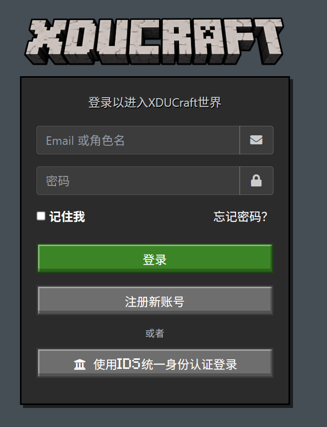
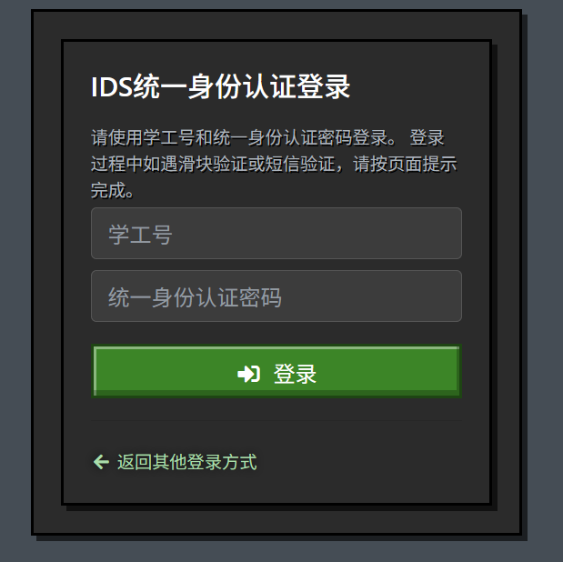
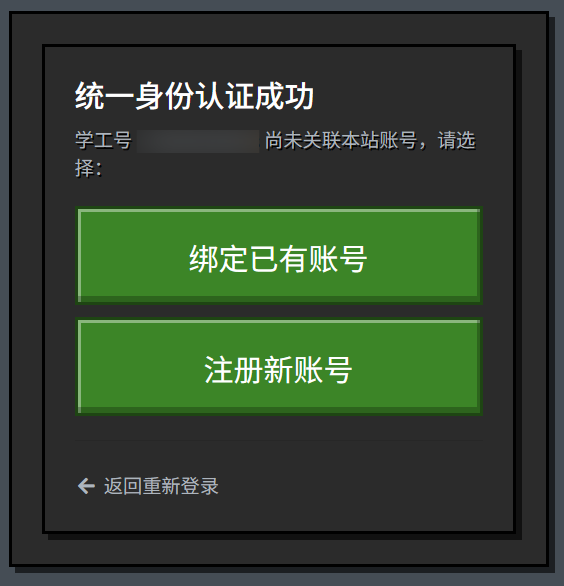
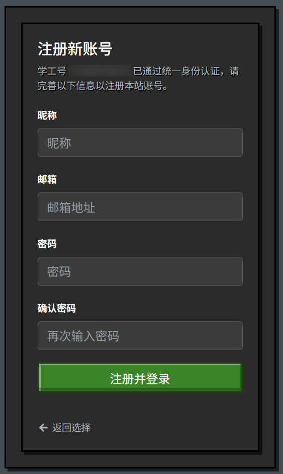
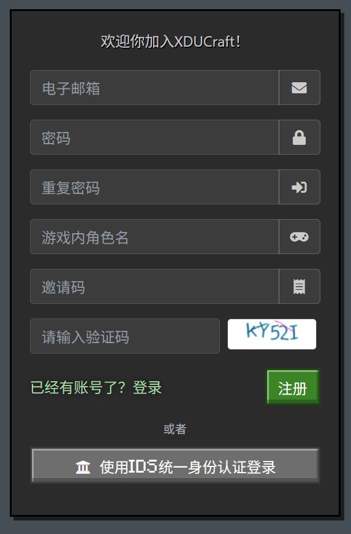
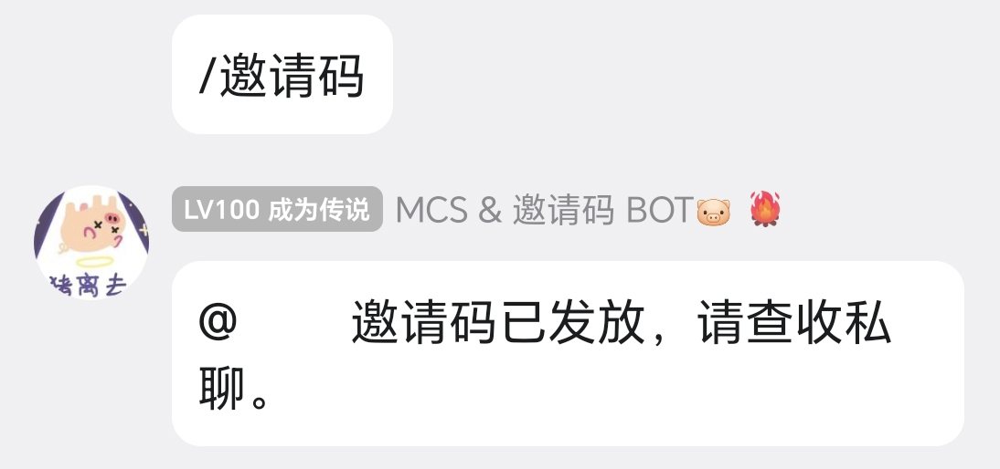

XDUCraft 的大部分服务器（如原版服、大厅服、SMP生电服等）采用自建皮肤站外置登录。这种方式无需玩家购买 Minecraft 正版账号，只需注册账号并在第三方启动器内做出一点配置即可。对于部分明确了正版登录的服务器（如部分模组服），则不需要进行皮肤站认证。

1. 于浏览器中打开 www.xducraft.cn 后，点击右上角的“登录”选项。登录页面如图 1 所示。

图 1  皮肤站登录框示意图

2. 皮肤站（xducraft.cn）现已支持通过 IDS 认证注册、登录和绑定。本统一身份认证非官方应用，请酌情决定是否使用。点击下方“使用IDS统一身份认证登录”，按提示填写学号、统一身份认证密码、动态口令等信息。IDS统一身份认证登录页面如图 2 所示。 

图 2  皮肤站IDS统一身份认证登录示意图

3. 通过ids注册后，会提示你绑定新邮箱账号或者已有邮箱账号，该账号将作为你登陆启动器的账户，请勿使用ids账号登录启动器。未在本站注册过皮肤站账号的用户，请点击“注册新账号”。

图 3  皮肤站关联本站账号示意图

4. 按提示填写**有效邮箱**、昵称等信息。填写完毕后，点击“注册并登录”。
> 📢 我们承诺不会发送垃圾邮件，也不会据此收集您的个人信息。
> 为确保皮肤站账号的正常运行，建议您使用常用邮箱，而**非10分钟邮箱等临时邮箱**，这样可以避免无法收到验证邮件，皮肤站无法登录等不便。

图 4  通过IDS统一身份认证注册账号示意图

5. 校外人员、不愿使用 IDS 认证，或遇到 IDS 服务异常时，可在登录页面点击“注册新账号”通过邀请码注册。

图 5  通过邀请码注册页面示意图

6. 在大群发送 “ /邀请码 ” 领取邀请码。若无法自助领取，请联系群主或管理员处理。

图 6  群聊内领取邀请码示意图

7. 按提示填写**有效邮箱**、昵称、邀请码等信息。填写完毕后，点击“注册”。
> 📢 我们承诺不会发送垃圾邮件，也不会据此收集您的个人信息。
> 为确保皮肤站账号的正常运行，建议您使用常用邮箱，而**非10分钟邮箱等临时邮箱**，这样可以避免无法收到验证邮件，皮肤站无法登录等不便。
