本部分内容同样将以 PCL2 与 HMCL 为例展开说明。其他启动器可以参阅网络教程。

# 4.1  PCL2

现在，让我们打开PCL2，第一次进入PCL2，你的界面应该是相当干净的，此时，可以进入QQ群中，找到图 1 的文件  

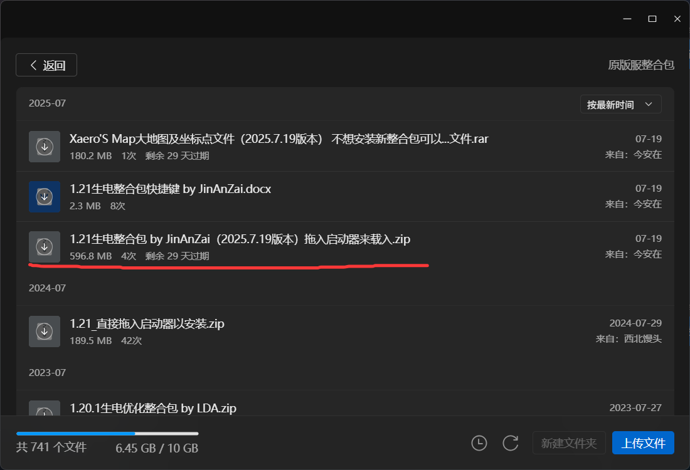

图 1 QQ 群文件的生电整合包示意图

将该文件下载下来之后，按照文件名所说的，将下载好的压缩包直接拖入PCL2界面，PCL2就会自动帮助你下载Java版本的MC-1.21。

如果你想先尝试其他的MC版本，可以在PCL2界面点击下载

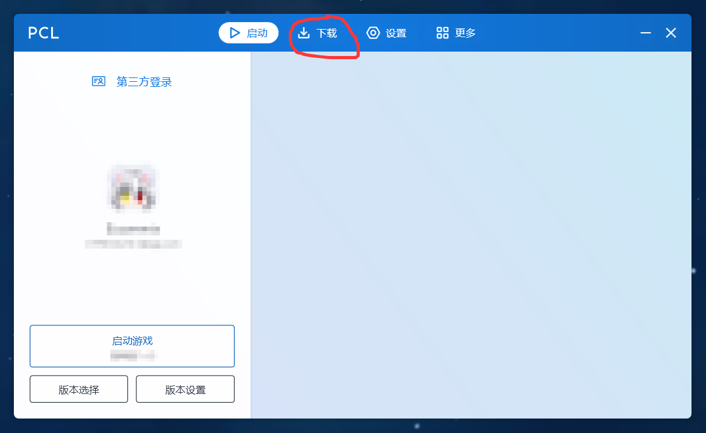

图 2 PCL2 启动器示意图

进入下载界面，在此处选择你心仪的版本下载游玩。

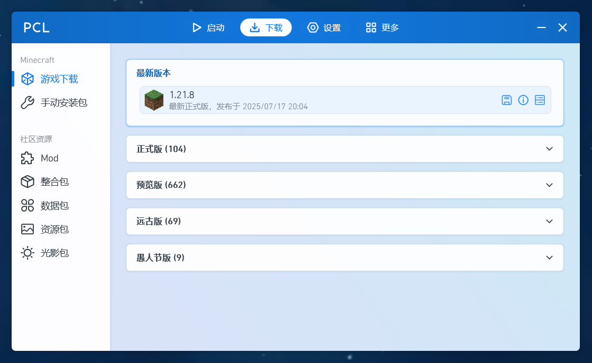

图 3 PCL2 下载游戏示意图

接下来，就到了进入游戏前的最后一步-->**登录**。 XDUCraft 作为 MUA（MC 高校联盟的成员），我们拥有自己的皮肤站， 接入了 Union 联合认证， 如果你已经按照前面提及的步骤完成了皮肤站的登录，那么你现在可以打开它并在任何采用联合认证的服务器上游玩。
> Union 联合认证是由 MUA 皮肤站和各高校皮肤站组成的玩家数据同步系统，可以允许来自多个成员皮肤站的玩家登录同一个 Minecraft 服务器，并且可以互相看见皮肤和披风。

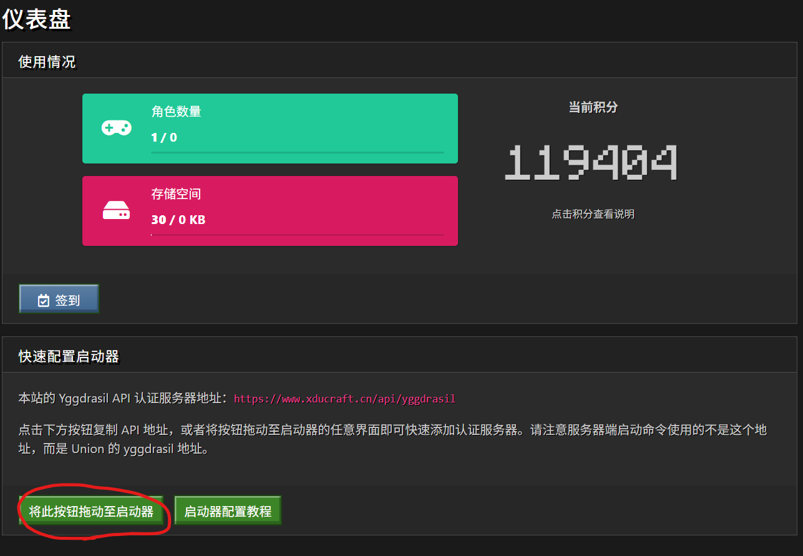

图 4 皮肤站网站的按钮示意图

找到图 4 中框选的按钮，按住，然后拖入 PCL2 之中

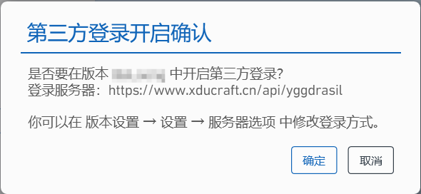

图 5 确认开启第三方认证示意图

点击确定，就会将你的登陆方式换成皮肤站登录，这允许你进入绝大多数 XDUCraft 和部分其他 MUA 成员的服务器，最终结果如下图

那么现在，准备工作已经完成，点击开始游戏，即可开始你的 MC 之旅。

如果**无法采用“将此按钮拖动至启动器”的方法添加皮肤站**，可以采取手动添加验证的方法。
按顺序点开 **版本设置-设置**，找到**服务器**一栏

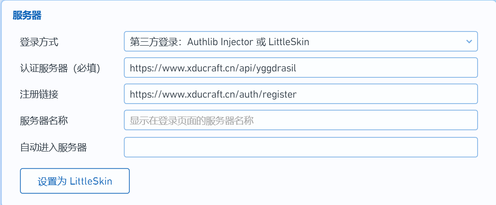

然后按图示填写信息：

登录方式
认证服务器（必填）
注册链接
服务器名称（选填）
自动进入服务器（选填）

第三方登录：Authlib Injector 或 LittleSkin
https://www.xducraft.cn/api/yggdrasil
https://www.xducraft.cn/auth/register
（如果你想要一启动游戏就进入服务器，和在多人游戏窗口设置服务器一样，第一个填写服务器名称（默认“Minecraft服务器”），第二个填写服务器IP

在添加完信息后，回到主页面，填写你皮肤站的账号及密码即可

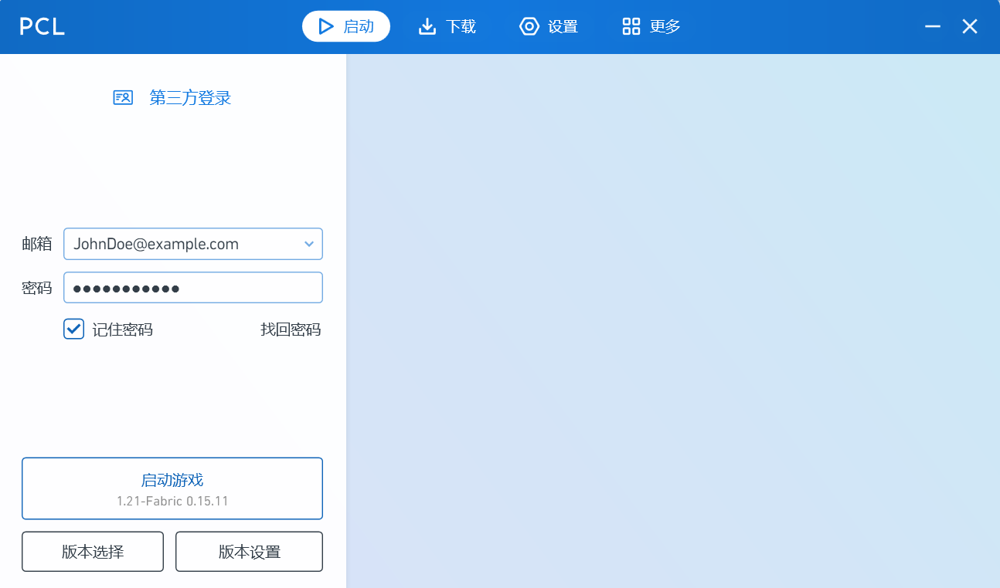

> 如果你并非游玩原版服务器，而是选择更加多彩多样的基于**模组/整合包/数据包**的服务器，则需要自行在 PCL2 下载界面下载，或者是将 QQ 群中开服的服主所发出来的，打包好的文件拖入 PCL2 下载，然后开启你的游玩。

> 另注，小编好累，如何自己开一个单人档，或者如何自行添加服务器这一部分的内容还请自行摸索，如果你如前文所述在群文件中下载并将 `1.21 整合包_by_JinAnZai` 拖入启动器，则在服务器列表会详细的列出， 无需自行添加 XDUCraft 的 1.21 服务器， 依据情况选择服务器即可。

# 4.2  HMCL

首次打开 HMCL 会联网下载必要的组件， 等待完成后会进入主界面。
登录皮肤站网站，进入用户中心——仪表盘，拖拽“将此按钮拖动至启动器”蓝色按钮到 HMCL 启动器上， 如图 6 所示。  

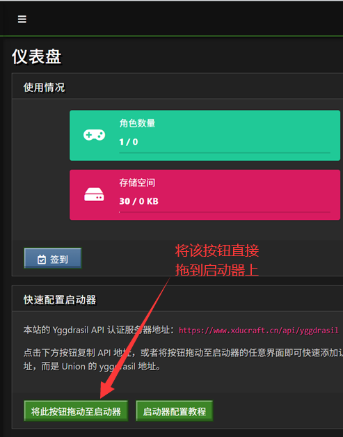

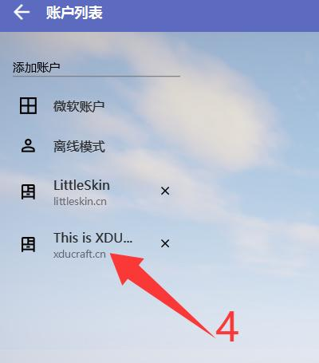

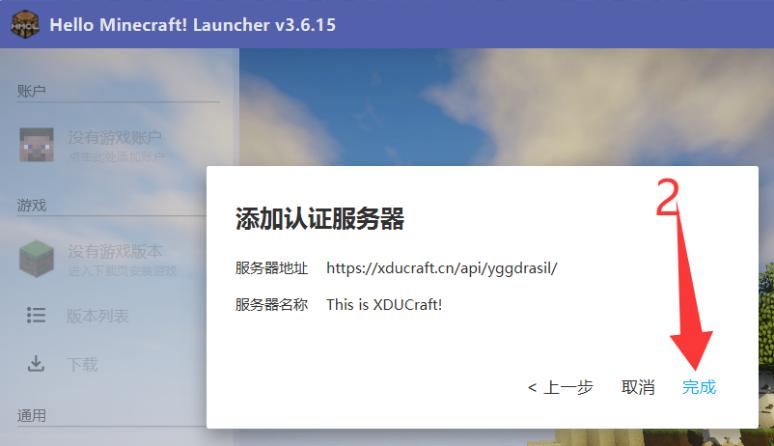

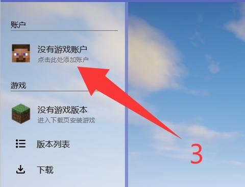

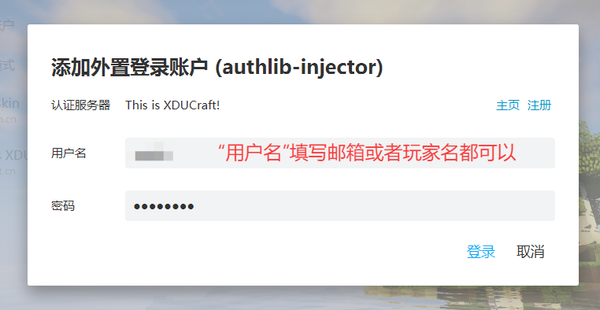

图 6 HMCL 启动器使用 XDUCraft 认证流程示意图

HMCL 与 PCL2 的区别在于， HMCL 的认证服务器与游戏是相互独立的， 而 PCL2 则不是； 通常来说， 对于需要给游戏经常修改认证方式的（比如切换用户、 切换正版/离线/第三方认证） 玩家说， HMCL 在这方面要更为便捷， 如图 7 所示。 

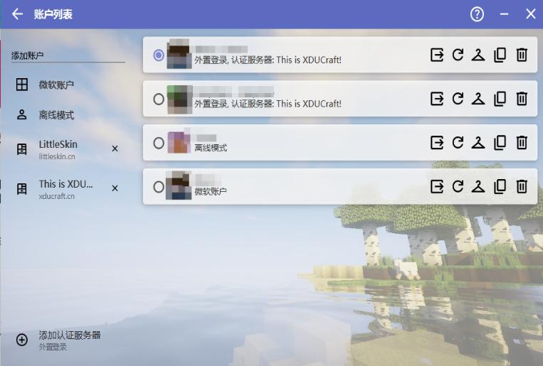

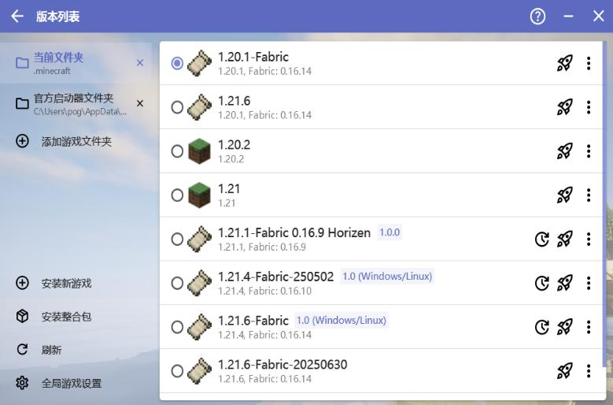

图 7 HMCL 的账户与游戏相互独立示意图

假设你已经安装了游戏， 那么选择一个游戏版本，完成可选的游戏配置（比如填写自定义的 JVM 参数、设置版本隔离、设置游戏内存占用、下载 Mod 等， 这里不过多赘述） ， 接着就可以启动游戏了。 此时的游戏能够登录任何 XDUCraft 皮肤站（以及 MUA）认证的服务器里。 当然， 任何正版验证的服务器此时是无法进入的， 毕竟认证服务器不同。
在 HMCL 里导入 1.21 生电整合包的流程可参见“4.1 PCL2”小节， 流程大同小异。 也可以联网查阅 HMCL 导入下载好的整合包教程。
