进入游戏（1.21）。 就该加入服务器游玩了。

**1）大厅服**
大厅的常驻公网 IP为**roaming.xducraft.cn**， 常驻校园内网 IP为 **lobby.xducraft.cn**。 由于地址具有时效性， 最新的地址见群公告， 或者在QQ 群里直接问也行。 你可以通过此上述 IP 进入 XDUCraft 的大厅服。在游戏内点击“多人游戏“后，继续点击”添加服务器“，在”服务器地址“一栏填写上述 IP 后点击完成， 随后即可加入服务器游玩。  

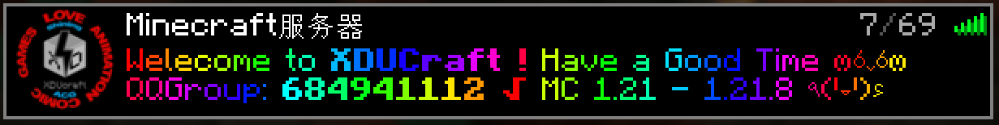

> 📢 有概率刷新出牢大头像哦.jpg
 
进入大厅后，即可选择想要前往的服务器。  

**2）SMP 生电服**
进入 SMP 需要先进入大厅服。 SMP 生电服是集建筑、生电、部分活动等等的集合子服。其内部通过地狱交通网络实现建筑、生电、活动等等的串联融合。
初次进入地图时，出生点位于如下地区。  

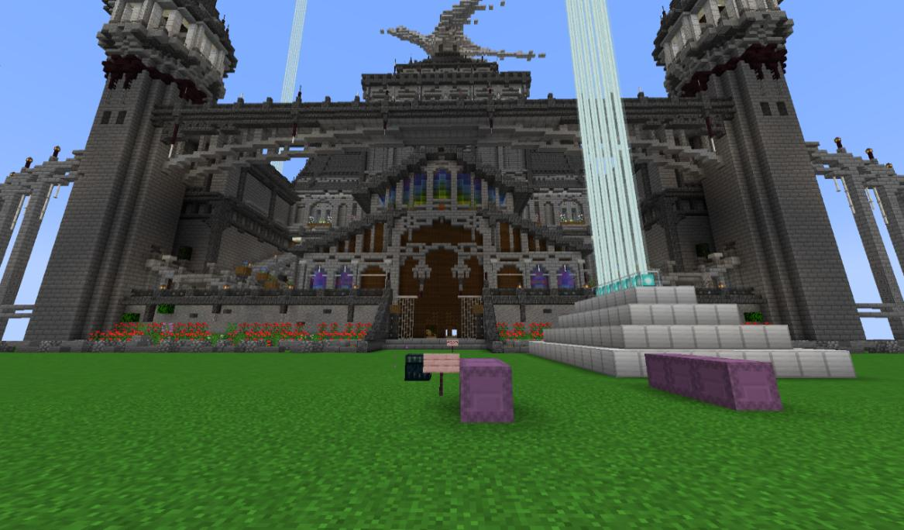

在这里，你可以找到基本的生存物资以及基础的指引。随后在下图的左侧潜影盒中获取船只以通过右图地狱门前往地狱交通。 你也可以在出生点找到新手礼包，其内配备了一些基础工具以跳过发育阶段。如果没有找到，你可以联系管理及时添加新手礼包或在下方给出的方式中自行获取物资。  

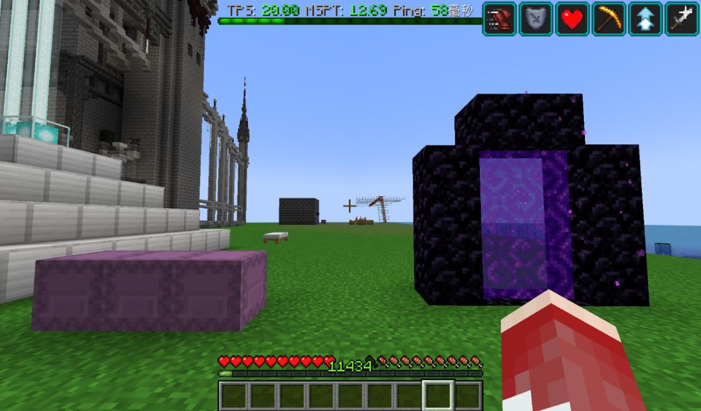

进入地狱后，根据告示牌指引，你可前往大多数地图。将船放置于冰面上，你即可快速前往想去的区域。此外，你也可以通过很多方式（自行翻盒子或朝其他群友求取）获取鞘翅及烟花火箭代替冰船。我们建议使用烟花火箭，但请注意留有富余以备不时之需。 接下来，将分别介绍建筑区等不同区域的大致情况。
其中，建筑区内覆盖一些玩家居所，原创、仿创或搬运建筑、像素画及一些其他建筑物。 在这里，你可以选择合适的位置自由搭建建筑（但请不要随意摆放以影响其他建筑的观赏性。 你可以在这里找到一些常用的建筑资源。  

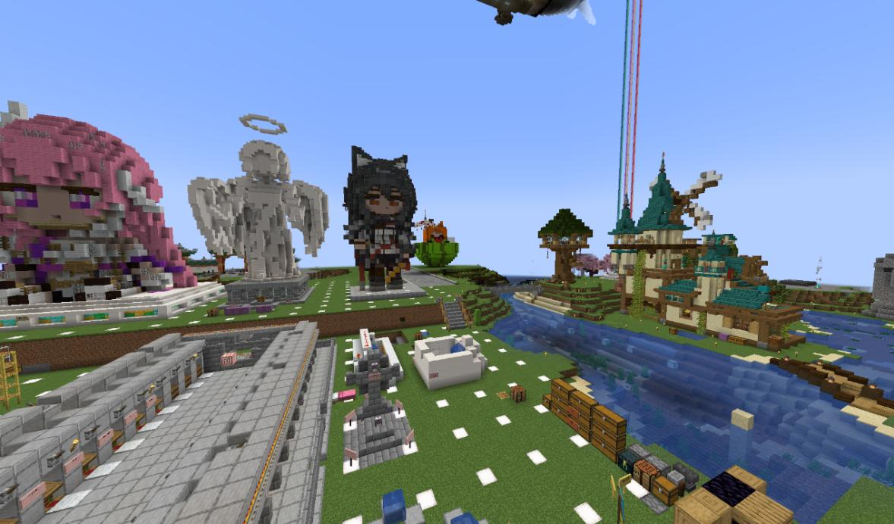

工业区内摆放着很多各式各样的机器。如果不清楚原理请不要擅自修改机器！！！ 你可以在此处获取一些资源以发育。
> 📢 如若想要开启机器获取资源，可以寻找机器上的告示牌获取开/关机指南，或者直接在 QQ 群中询问，会有大佬解答你的问题的 awa 

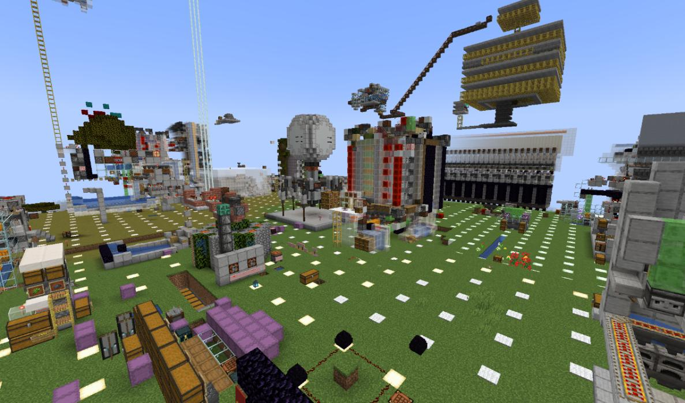

其余区域可以自行探索，这里不再一一赘述~  
**3）复原工程**
复原工程的工地位于大厅服。 在这里，我们以一定比例复原了学校的长安校区（南校区）。现在正在施工，但仍可参观。若想了解或参与复原工程，可进入 XDUCraft 建筑组群。  

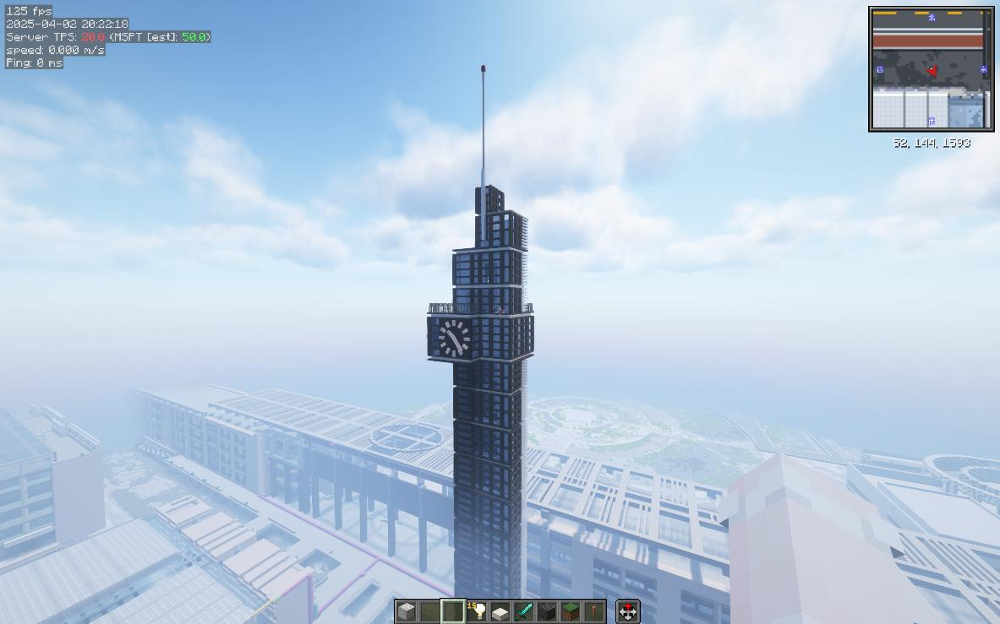

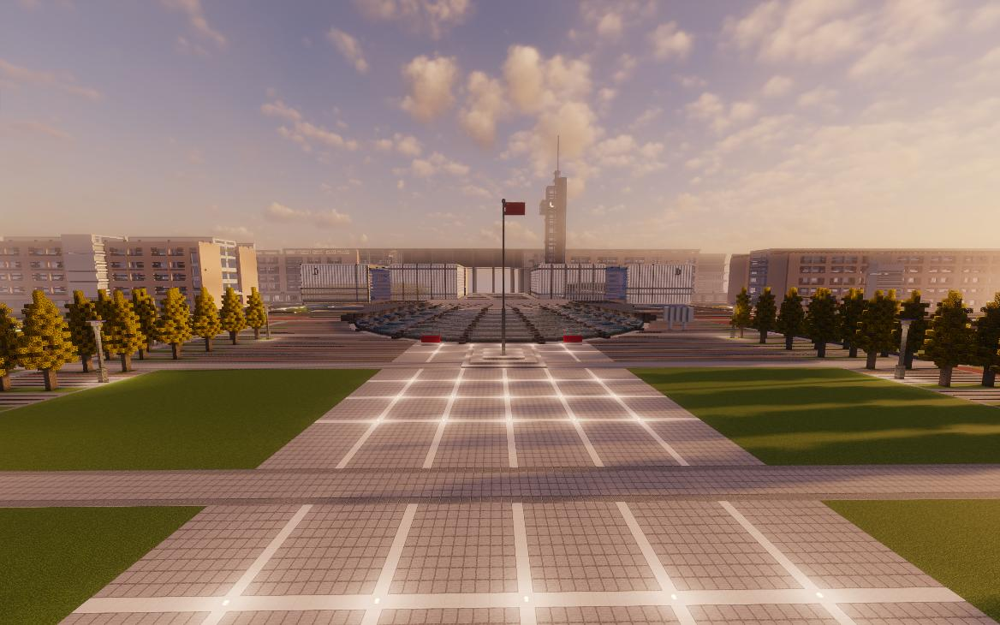

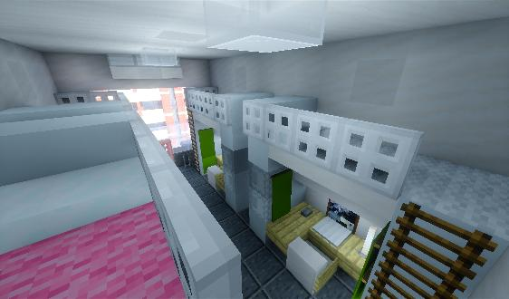

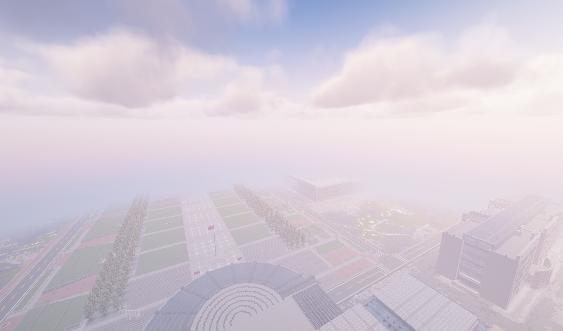

**4）创造服**
创造服一般用来测试机器，设计建筑，设计好的建筑会被实装到 SMP 中。  

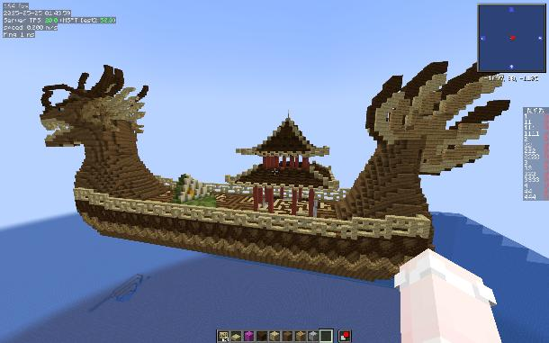

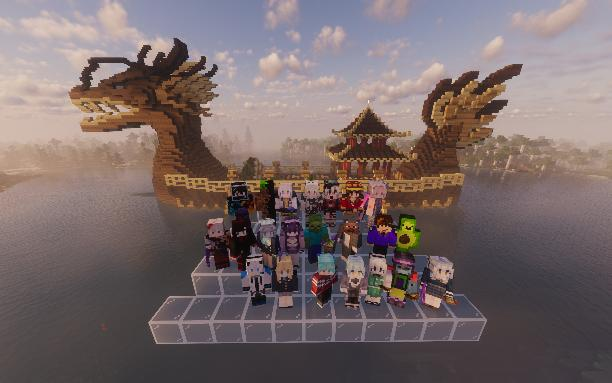

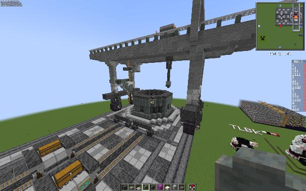

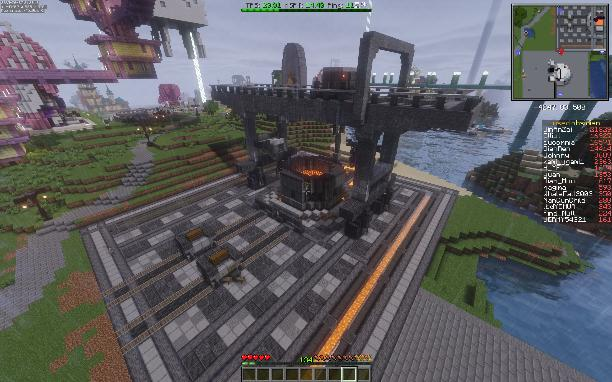

左图为创造服截图，设计好之后实装到 smp 的效果如右图所示。  
**5）小游戏服**
大厅里的小游戏服似了，长时间闲置。 更多时候，小游戏活动会在群内通知，并具有单独的 IP。
