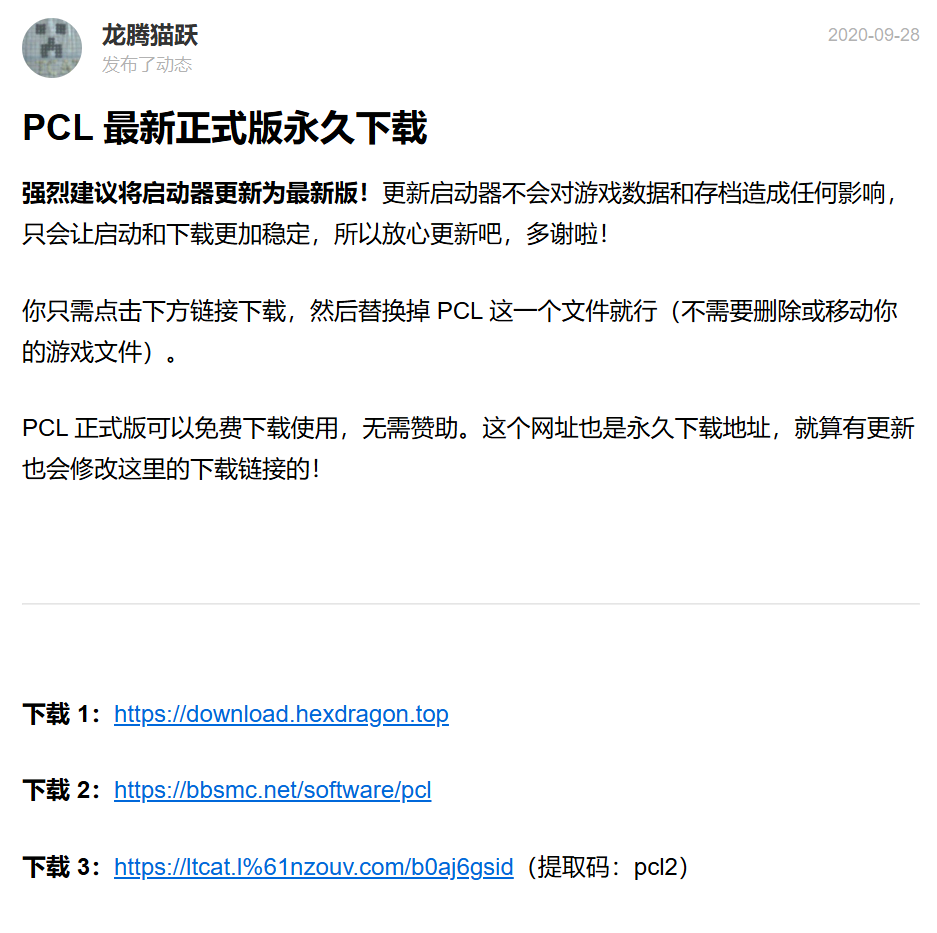
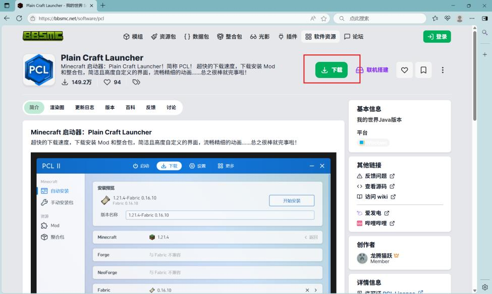
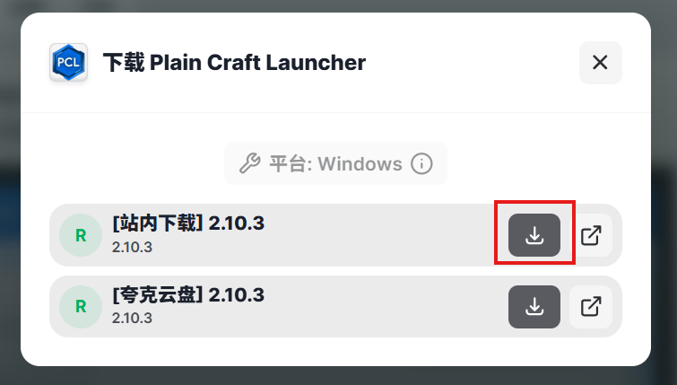
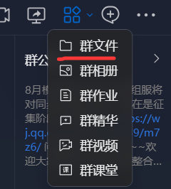
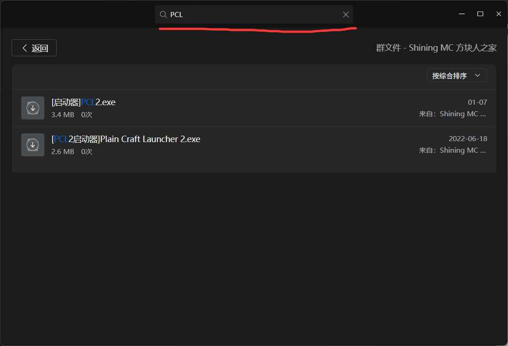
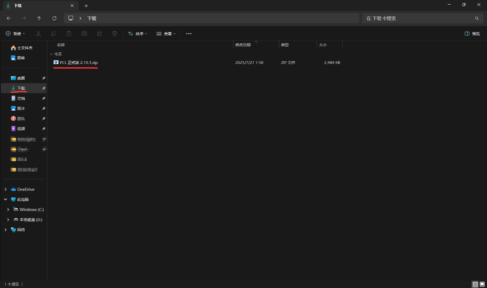
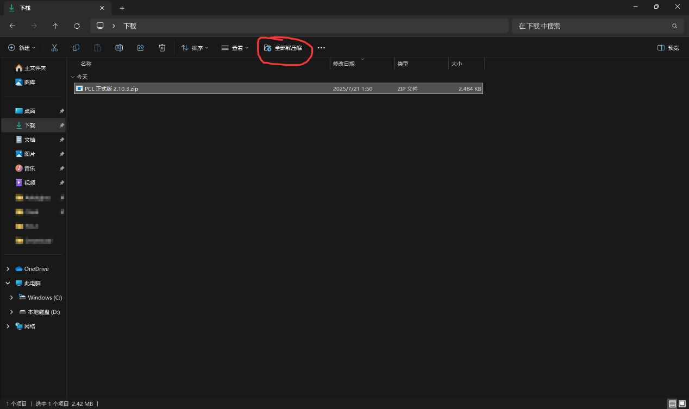
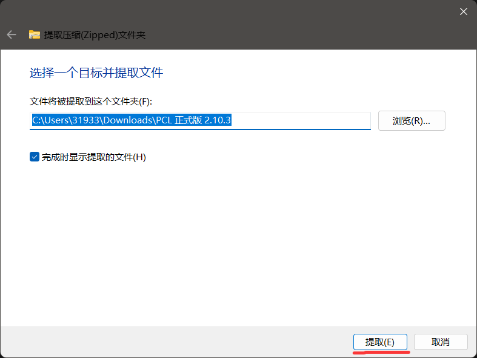

本文以 **BBSMC 下载站** 为例，介绍 PCL2 启动器的下载、解压与打开流程。

## 1. 安装与下载

你可以使用任意浏览器访问 PCL2 的下载页面，推荐使用 **Microsoft Edge** 或 **Google Chrome**。

PCL2 可以通过以下两种方式获取：

* 官方渠道下载
* XDUCraft QQ 群群文件下载

### 1.1 官方渠道下载

在浏览器中访问：

https://afdian.tv/a/LTCat

即可进入 PCL2 作者的爱发电主页，并免费下载 PCL2。

> 作者目前提供以下三种下载方式：  
> 下载 1（夸克网盘）：https://download.hexdragon.top  
> 下载 2（BBSMC）：https://bbsmc.net/software/pcl  
> 下载 3（蓝奏云）：https://ltcat.lanzouv.com/b0aj6gsid   提取码：`pcl2`    

下面以 **下载 2：BBSMC 下载站** 为例进行说明。

访问：

https://bbsmc.net/software/pcl

进入网站后，点击下图中框选的 **“下载”** 按钮。

随后点击页面中的 **“站内下载”** 按钮，等待片刻即可完成下载。

除此之外，你也可以通过下方的夸克网盘链接进行下载：

https://pan.quark.cn/s/8a343b247b18#/list/share

### 1.2 QQ 群文件下载（电脑端）

进入 XDUCraft QQ 群后，找到并点击下图中框选的 **群文件图标**。

在弹出的界面中点击 **“群文件”**。

进入群文件界面后，在下图所示的搜索区域输入：

`PCL2`

搜索对应文件并下载即可。

## 2. 解压并打开 PCL2

> 如果你是从 QQ 群文件中直接下载的 `PCL2.exe`，通常无需进行解压，可以直接跳到本节最后一步。

如果你是从官网下载的 PCL2，那么在 Windows 默认的 **“下载”** 文件夹中，通常可以看到一个后缀为 `.zip` 的压缩文件。

### 2.1 解压压缩包

左键单击该 `.zip` 文件将其选中。

此时，文件资源管理器顶部会出现 **“全部解压缩”** 选项，如下图所示。

点击 **“全部解压缩”** 后，会出现解压设置窗口。

确认解压位置后，点击右下角的 **“提取”**。

解压完成后，可以在下载文件夹中看到一个新的文件夹。

打开该文件夹，即可看到 PCL2 的程序文件。

### 2.2 如果没有“全部解压缩”选项

如果你的系统中没有出现 **“全部解压缩”** 选项，可以自行安装第三方解压软件。

推荐使用：

* 7-Zip

安装后，使用解压软件打开 `.zip` 文件并将其中的内容解压到一个文件夹即可。

本文不再对第三方解压软件的安装与使用进行详细说明。

### 2.3 打开 PCL2

找到解压后的：

`PCL2.exe`

双击运行即可打开 PCL2 启动器。
