---

title: 整合包食用指南
description: 整合包食用指南
---

> 考虑到部分新手玩家可能因为对某个整合包感兴趣，或者经由亲友推荐而第一次尝试 MC 整合包，却又因为找不到教程、不熟悉启动器等原因不知道从何下手，因此写下这篇指南，希望能帮助新人尽快完成从“下载整合包”到“成功进入游戏”的过程。
>
> 如果本文仍有未能说明清楚的地方，也可以查看群文件中的其他新人教程，或者直接在群内提问。
>
> **ps.** 实际上是小编教同学体验人生第一个整合包时，被各种奇奇怪怪的问题折磨得头都大了，实在难受，遂有此文 QWQ

# 🗒️ 阅读前的一点说明

在正式开始之前，有几件事情需要先说明。

1. **本文并不是整合包游玩攻略。**
   本篇指南主要解决的是“正式进入游戏之前”可能遇到的问题，例如整合包在哪里下载、如何安装、如何导入启动器等。

   至于某个具体整合包应该怎么玩、任务线如何推进、某个机器怎么造等内容，请自行搜索对应整合包的攻略。

   重要的事情说三遍：

   **这不是整合包游玩攻略！**
   **这不是整合包游玩攻略！**
   **这不是整合包游玩攻略！**

2. **本文全程基于 PCL2 启动器。**
   如果你使用的是 HMCL 或其他 Minecraft 启动器，大致流程通常不会有太大区别。

   但由于不同启动器之间在界面和具体操作上可能存在差异，小编没办法面面俱到。如果遇到不一致的地方，可以在群内询问，或者自行搜索对应启动器的教程。

3. **本文全程基于 Windows 11 环境。**
   因此部分操作界面可能与你实际使用的系统略有不同。

   > ps. 你知道的，Windows 10 和 Windows 11 还是有亿点啸差距。

4. 本文会主要使用 **Better MC** 和 **落幕曲** 作为示例。
   其他整合包的安装流程通常大同小异。如果遇到特殊情况，可以在群内询问或者自行查找对应教程。

   > ps. 绝对不是因为小编喜欢玩落幕曲的原因 <(￣︶￣)>

# ✈️ 开始安装整合包吧 ｡:.ﾟヽ(*´∀`)ﾉﾟ.:｡

首先打开 **PCL2**。

在主界面顶部点击 **“下载”**，随后在左侧菜单中选择 **“整合包”**。

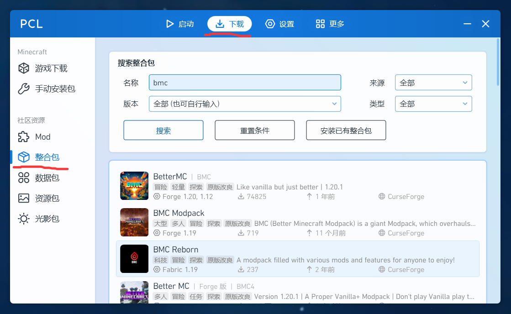

接下来根据整合包的来源，可以分成两种情况：

* 可以直接在 PCL2 中搜索并下载；
* 无法在 PCL2 中找到，需要从互联网下载整合包文件后再导入。

---

# 1. 直接通过 PCL2 下载整合包

对于 **Better MC** 这类比较经典、知名度较高的整合包，通常可以直接通过 PCL2 内置的整合包搜索功能找到。

例如搜索 Better MC：

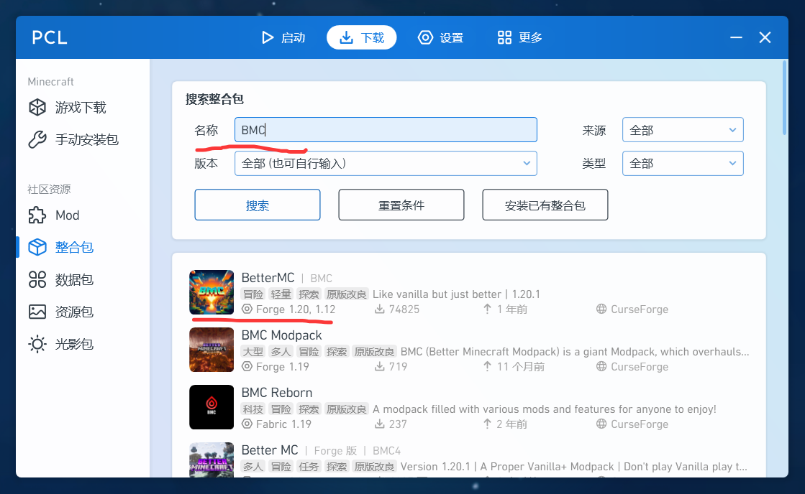

如果你想玩的整合包能够直接搜索到，那么恭喜你——接下来的过程会轻松很多。

点击对应的整合包，进入版本选择页面。

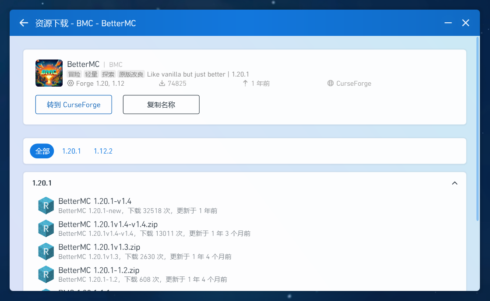

## 1.1 选择整合包版本

进入整合包页面后，选择你希望游玩的 **游戏版本 / 整合包版本**。

点击对应版本后，PCL2 会弹出安装窗口。

在这里可以修改 **“版本名”**。

这个名字实际上就是整合包在 PCL2 中显示的名称，你可以理解为给这个实例加一个备注。

小编个人比较推荐使用：

`整合包名-游戏版本-整合包版本`

例如：

`BetterMC-1.20.1-v32`

这样以后同时安装多个版本时会比较容易区分。

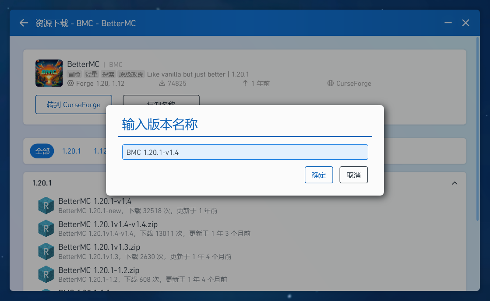

确认无误后点击 **“确定”**。

此时 PCL2 右下角会出现下载图标。

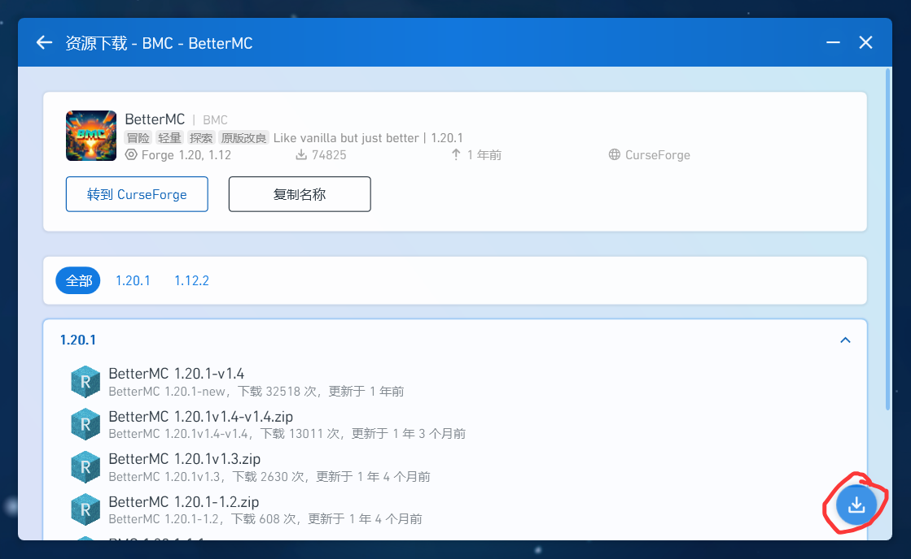

## 1.2 等待下载完成

点击右下角的下载图标，可以查看整合包的具体下载进度。

部分整合包还会提供一些 **可选模组**。

例如 Better MC 在安装过程中可能会弹出窗口，询问你是否需要额外安装某些可选内容。

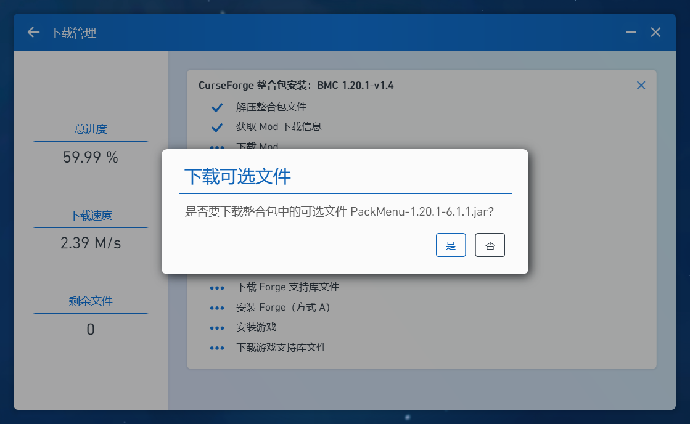

这些内容通常用于提供额外功能或者不同的游戏体验。

如果希望获得更完整的体验，可以根据自己的需求选择安装；如果不需要，也可以不安装。

## 1.3 启动整合包

下载完成后返回 PCL2 主界面。

点击 **“版本选择”**，找到刚刚安装好的整合包。

选择它，然后启动游戏即可。

到这里，如果一切正常，你已经可以开始游玩啦 ξ( ✿＞◡❛)

---

# 2. 从互联网下载整合包

有些整合包比较新，或者由于其他原因，无法直接通过 PCL2 搜索到。

例如本文反复提到的 **落幕曲**。

这种情况下，我们就需要自己寻找整合包文件。

## 2.1 CurseForge 与 Modrinth

如果你仔细观察 PCL2 的整合包搜索页面，会发现右上角存在一个 **“来源”** 选项。

点击之后，可以看到两个常见平台：

* CurseForge
* Modrinth

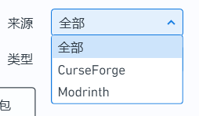

它们都是非常常用的 Minecraft 模组及整合包资源平台。

### CurseForge

CurseForge：

https://www.curseforge.com/

CurseForge 提供多种游戏的 Mod、整合包等资源，Minecraft 只是其中的一部分。

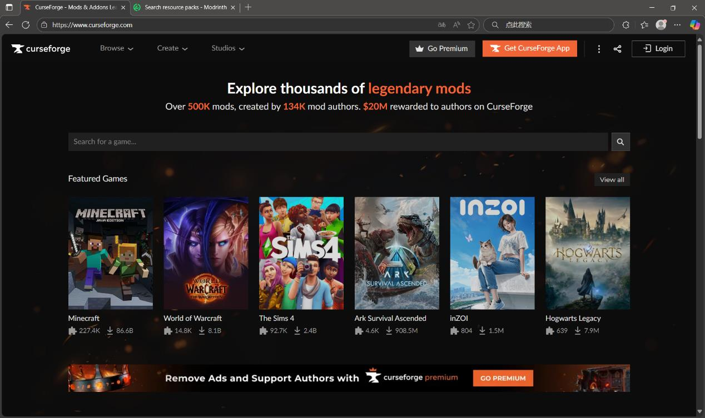

在整合包页面中，可以通过 **Files** 页面查看并选择不同版本。

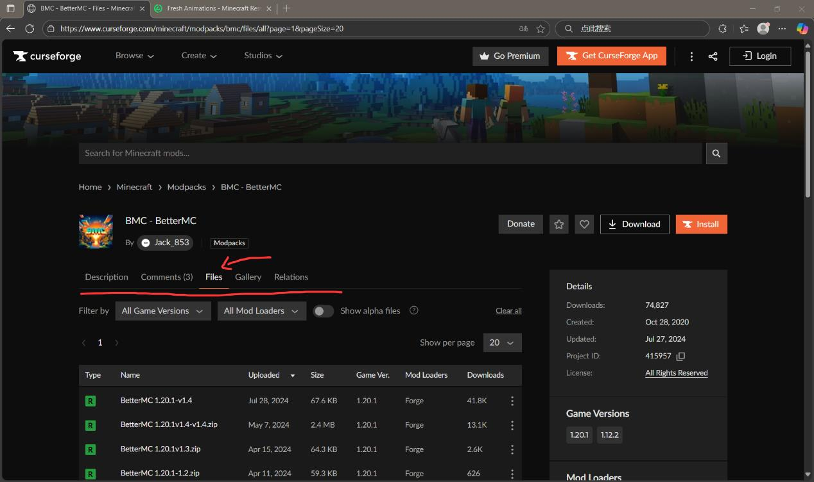

### Modrinth

Modrinth：

https://modrinth.com/modpacks

相比之下，Modrinth 主要面向 Minecraft 相关资源。

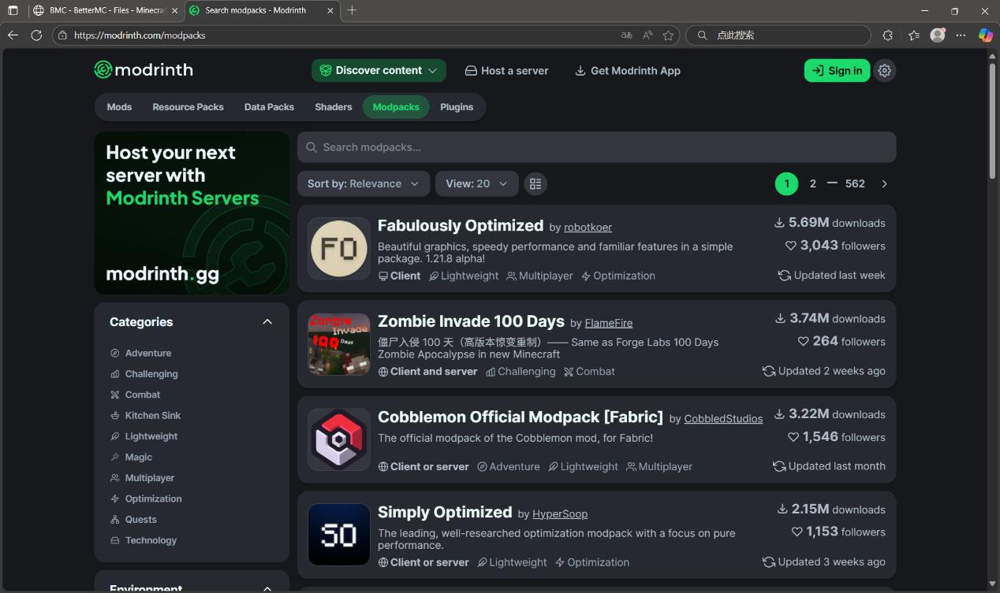

如果使用 Modrinth，则可以在 **Versions** 页面选择需要的版本。

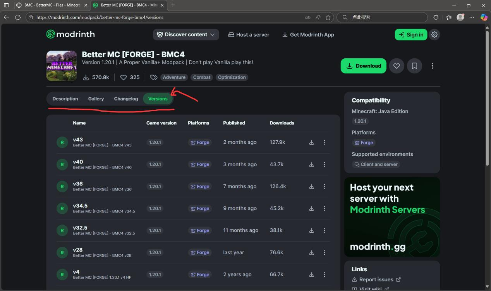

## 2.2 下载之后为什么是压缩包？

这时候你可能已经发现了：

**“欸，怎么下载下来是个压缩包？”**

不要慌张。

这是很正常的情况。

在文件夹中找到刚刚下载的整合包压缩文件，然后直接像平时拖动文件一样：

**把整个压缩包拖进 PCL2 窗口。**

注意：

**不要提前把用于导入的整合包压缩包解压。**

如果文件格式能够被 PCL2 正确识别，PCL2 会自动开始导入并安装整合包。

> ps. 跟我一起说——
> **“赞美 PCL2！”**

安装完成之后，与前面的流程一样，在版本选择页面中找到对应整合包并启动即可。

---

# 3. 如果 CurseForge 和 Modrinth 都找不到怎么办？

你还可能发现：

**“主包主包，你不是从开头就在唠叨‘落幕曲’吗？怎么这里根本搜不到呀？”**

小编的回答只能是：

**不急，我有一计。**

实际上，除了 CurseForge 和 Modrinth 之外，整合包的发布渠道还有很多。

尤其是近年来国产整合包越来越丰富，不少作者会直接通过 **Bilibili** 等平台发布整合包。

通常情况下：

1. 作者发布整合包宣传视频；
2. 在视频简介或者置顶评论中提供下载地址；
3. 玩家通过作者提供的链接下载整合包。

例如小编最喜欢的落幕曲：

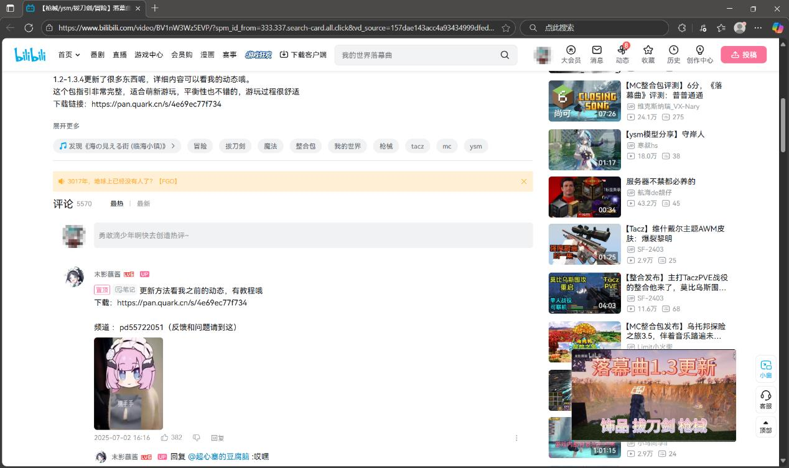

因此，如果在 CurseForge 或 Modrinth 中找不到某个整合包，可以尝试直接搜索：

`整合包名称 + Bilibili`

或者：

`整合包名称 + 下载`

通常能够找到作者的发布页面。

除此之外，也可以尝试其他 Minecraft 资源网站，例如：

XyeBBS：

https://resource.yxsjmc.cn/

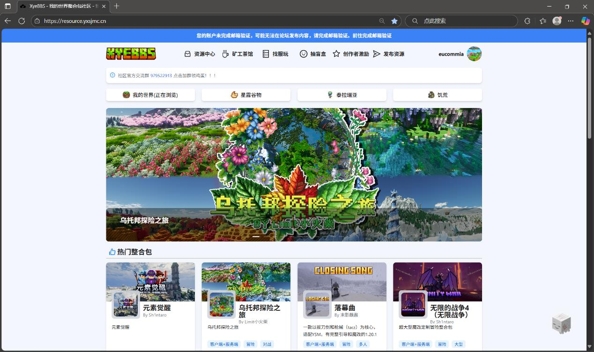

> ps. 如果这样都还找不到……
> 不能吧，我都这么努力了你怎么还没找到 இдஇ

不过需要注意，尽量优先选择 **整合包作者本人提供的下载地址** 或者可信的 Minecraft 社区来源。

---

# ⭐️ 一些推荐与 Tips

下面是一些在实际游玩整合包过程中比较容易遇到的问题。

## 1. Shift 键导致输入法切换

如果你是一名 MC 新手，可能会经常遇到：

**按 Shift 时触发输入法切换，影响游戏操作。**

一种比较简单的解决办法是给 Windows 添加英文键盘。

打开 Windows 设置中的 **语言** 相关选项，添加英语：

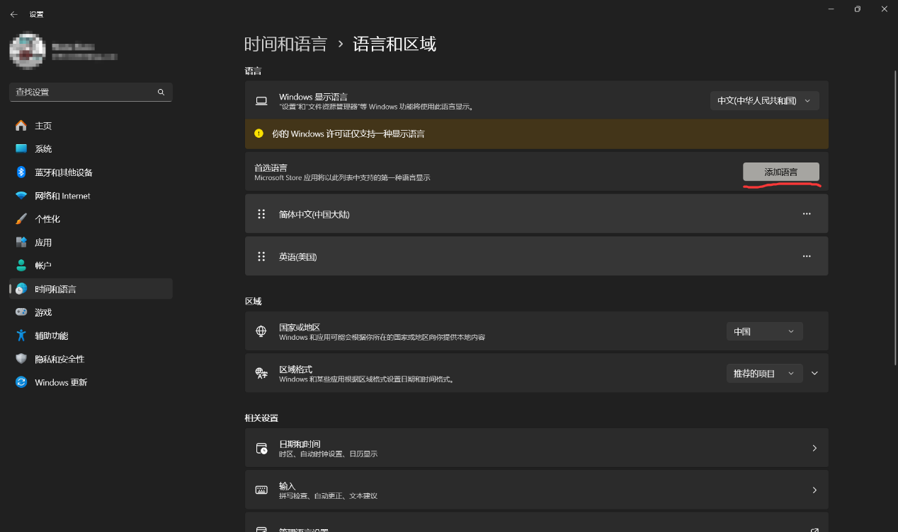

进入 Minecraft 之前，将右下角的键盘语言切换成英文。

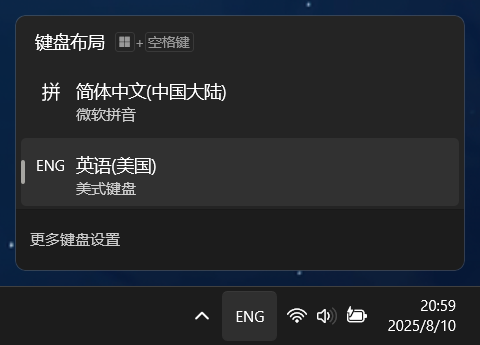

这样可以减少游戏中因为 Shift 等按键导致输入法干扰的问题。

---

# 2. 整合包更新后如何迁移旧存档？

如果你已经玩了一段时间某个整合包，后来发现整合包更新了，那么可能会希望：

**在新版本整合包中继续使用旧版本的存档。**

下面以整合包版本：

`v2.2 → v2.3`

为例。

首先找到旧版本整合包对应的游戏文件夹。

例如小编自己的 PCL2 游戏目录为：

`D:\PCL2\Release 2.8.6\.minecraft\versions`

你的实际目录可能与此不同。

进入旧版本整合包的文件夹后，可以重点关注以下内容：

* `saves`
* `XaeroWaypoints`
* `config`

它们大致分别对应：

| 文件夹              | 用途              |
| ---------------- | --------------- |
| `saves`          | 游戏存档            |
| `XaeroWaypoints` | Xaero 小地图保存的路径点 |
| `config`         | 部分模组及游戏相关配置     |

> 如果整合包没有安装 Xaero 小地图，则不会存在 `XaeroWaypoints` 文件夹。

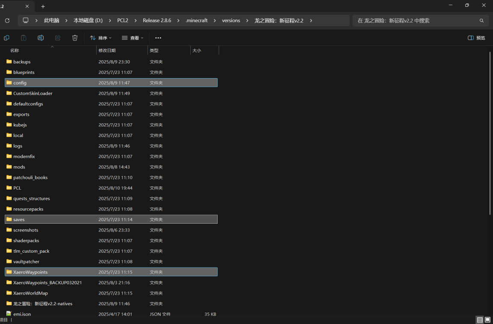

将需要迁移的文件夹复制，然后粘贴到新版本整合包对应的游戏目录中。

如果 Windows 提示存在同名文件，可以根据实际情况选择 **替换 / 覆盖**。

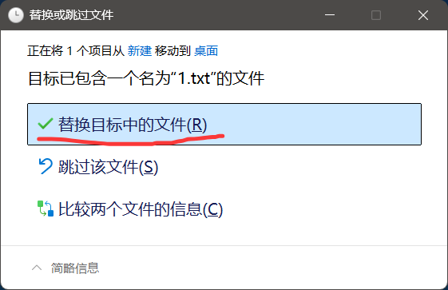

不过这里需要特别提醒：

> **升级整合包之前，强烈建议先备份旧版本实例和存档。**

不同版本之间可能存在模组增删、配置改变、世界生成变化等情况，并不是所有整合包都能够完全无缝地迁移。

尤其是 `config` 文件夹，直接覆盖旧配置有时反而可能造成兼容性问题。

因此更稳妥的做法通常是：

1. 首先备份整个旧版本实例；
2. 优先迁移 `saves`；
3. 有需要时再迁移路径点等个人数据；
4. `config` 是否覆盖，需要根据整合包作者的升级说明决定。

---

# 3. 不要直接复制旧版本的 DLC 模组

有些整合包允许玩家自行添加可选的 **DLC 模组**。

例如某些整合包会额外提供：

* 扩展内容；
* 额外维度；
* 新生物；
* 新任务；
* 可选的大型内容模组。

这些模组和前文 Better MC 中的普通可选辅助模组并不完全相同，它们可能直接影响整合包的主要游戏内容。

如果整合包进行了版本更新，DLC 模组本身也可能同步更新。

因此：

**不要直接把旧版本整合包中的 DLC 模组复制到新版本中。**

更加稳妥的方法是：

**重新下载整合包作者针对当前版本提供的最新版 DLC。**

否则可能出现：

* 游戏无法启动；
* 模组依赖冲突；
* 方块或物品贴图丢失；
* 存档异常；
* 游戏内容缺失；

等问题。

---

# 4. 关于收费整合包

一般情况下，正常发布的 Minecraft 整合包及其基础资源都可以通过作者或相关社区提供的渠道获取。

因此，如果你在某些交易平台上看到所谓：

* “XX 整合包完整版”
* “一键整合包”
* “独家整合包资源”
* “付费代下载”

等商品，不建议仅仅因为“方便”或者“懒得找”就直接购买。

很多情况下，卖家提供的文件本身就来自作者公开发布的资源。

更推荐优先通过：

* 整合包作者发布页面；
* CurseForge；
* Modrinth；
* 作者 Bilibili；
* 作者提供的网盘；
* 可信 Minecraft 社区；

等渠道获取整合包。

> ps. 实际上自己下载往往也没有麻烦多少 (￣▽￣)

关于具体资源的使用和再分发要求，则应以 **Minecraft 官方规则以及对应整合包、模组、资源包作者的许可说明** 为准。

---

# 5. 什么是“懒人包”？

在下载某些整合包时，资源提供者可能会提供一种更加直接的安装方式。

这种资源通常被玩家称作：

**“懒人包”**

这里以某个宝可梦整合包为例。

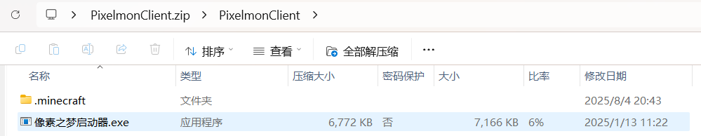

解压之后，你可能会看到类似下面的内容：

* 一个名为 `xxx启动器.exe` 的程序；
* 一个 `.minecraft` 文件夹；
* 或者其他已经配置好的游戏文件。

这种情况下，通常有两种使用方法。

## 方法一：直接使用附带的启动器

如果资源中包含：

`xxx启动器.exe`

可以尝试直接运行它。

如果整个懒人包仍然位于压缩文件中，请先将它完整解压。

部分情况下，如果没有解压就直接运行，系统也会提示你先进行解压。

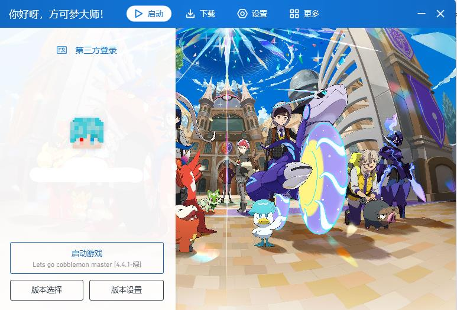

随后按照启动器提示进行操作即可。

---

## 方法二：导入到自己原有的启动器

如果你不希望使用整合包附带的启动器，也可以尝试使用自己原有的 PCL2。

将 **原始整合包压缩文件** 直接拖入 PCL2。

> 注意：这里拖入的是压缩包本身，不要提前把用于导入的文件解压后再拖入。

如果 PCL2 能够识别该整合包，它会提示你选择安装位置。

选择一个空文件夹后，PCL2 会开始处理文件。

此时右下角会出现与前文类似的下载 / 安装进度图标。

安装完成后，可以看到类似下图的目录结构：

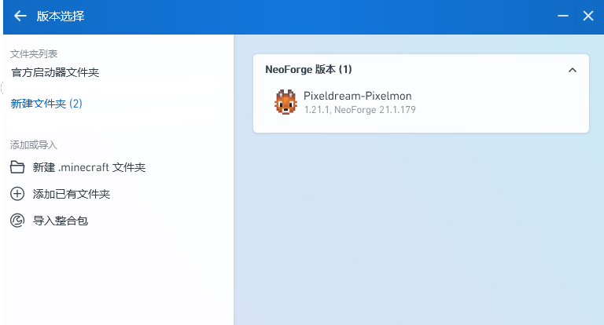

其中，新生成的文件夹名称取决于你之前选择的安装位置以及版本名称。

对应的游戏版本就是刚刚导入的整合包。

之后可以回到 PCL2 的版本选择页面，选择该版本进行启动。

通过以上任意一种方式，都可以尝试正常启动懒人包。

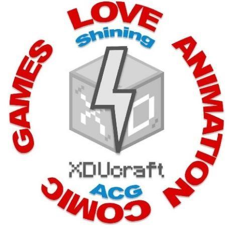

---

# 🎉 最后

到这里，你应该已经掌握了几种最常见的整合包安装方式：

* 直接通过 PCL2 搜索并安装；
* 从 CurseForge 下载后导入；
* 从 Modrinth 下载后导入；
* 从整合包作者提供的页面下载；
* 导入已经下载好的整合包压缩文件；
* 使用或导入“懒人包”；
* 将旧版本存档迁移到新版本。

不同整合包之间可能仍然存在一些特殊情况，因此在遇到问题时，建议优先查看 **整合包作者提供的安装说明、FAQ 和更新日志**。

如果实在解决不了——

**欢迎来群里抓一个看起来很懂的人问.jpg**
