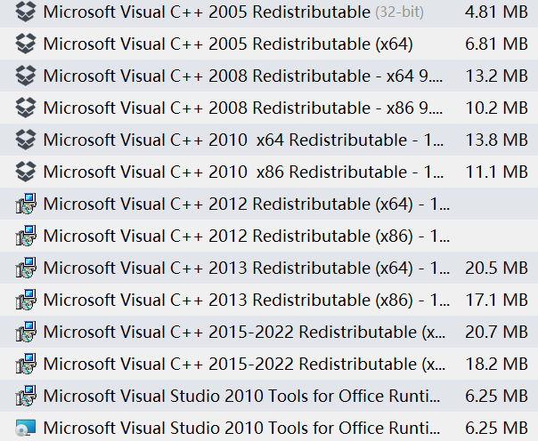
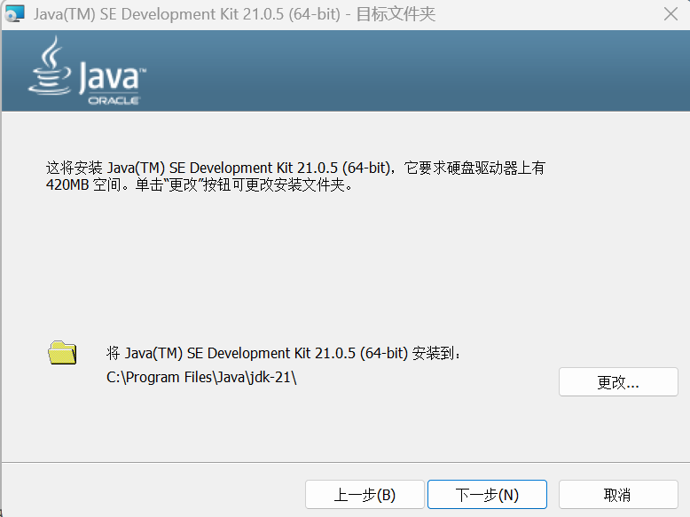
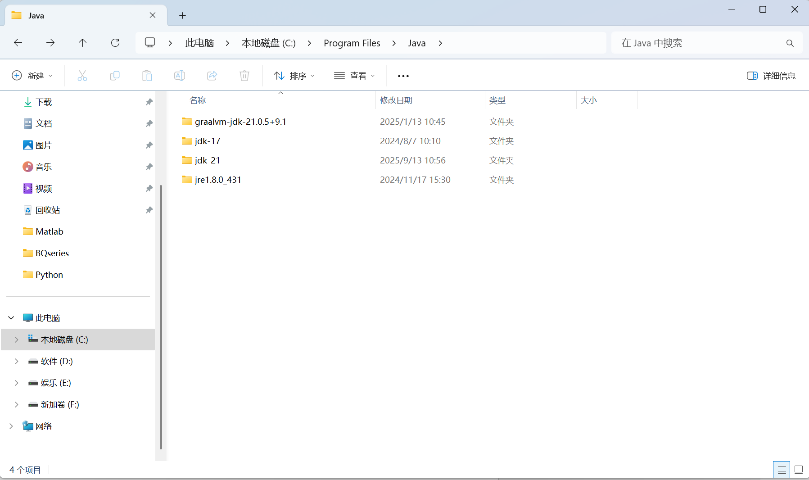
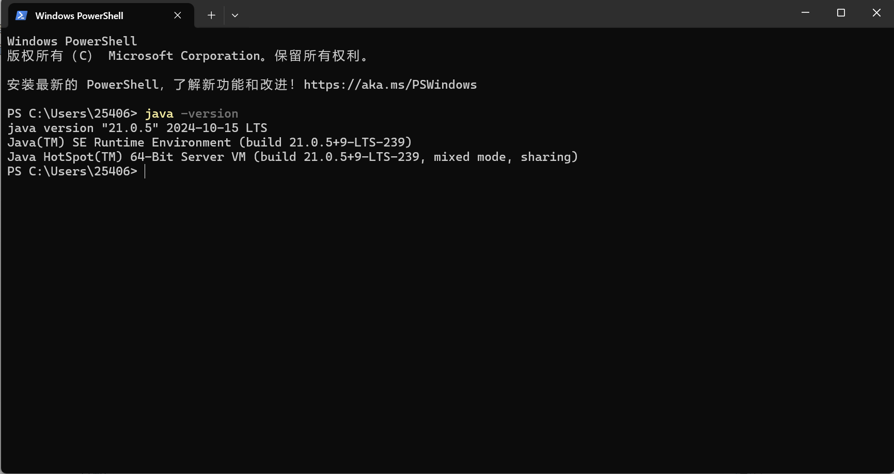
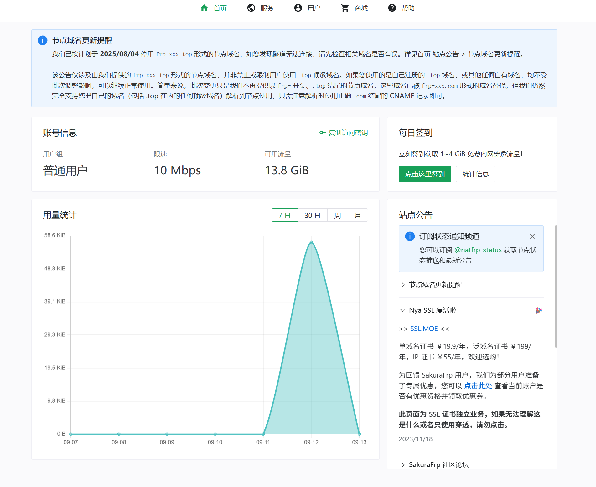
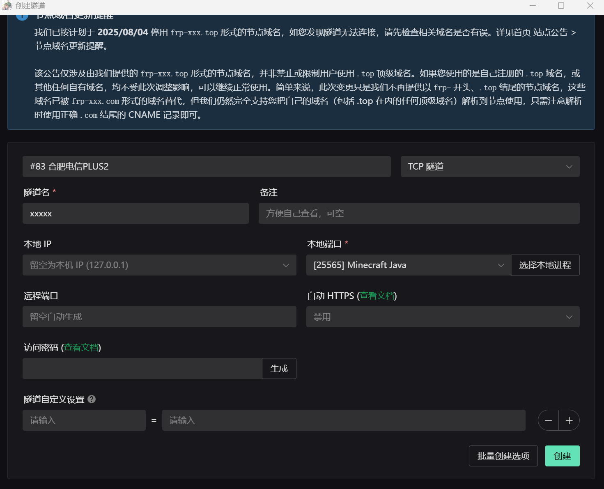

在开服之前你需要准备的东西大致分为这几个方面：
  1. 环境搭建，即运行服务端核心的JAVA环境。
  2. 网络方面，让别人能加入你的服务器。
  3. 一个好用的文本编辑器，推荐VScode或Notepad++，这在你后续更改配置时会非常有用。
下面将围绕a、b指导你搭建一个能运行MC服务端核心的环境

# 1.1 Java环境搭建

如果你留意过你电脑安装的文件列表，一定注意到过跟下图一样让你摸不着头脑的一大堆文件:



这些文件就是安装在你电脑上的一些运行环境，现代游戏在安装过程中一般会自动解决掉环境的问题，但是MC作为一个拥有十几年历史的“老游戏”并不能做到这点，虽然启动器作者会给客户端擦屁股（），运行服务端核心的时候需要你手动安装运行环境**JDK（Java Development Kit）**，推荐的有：[Oracle发行标准版](https%3A%2F%2Fwww.oracle.com%2Fjava%2Ftechnologies%2Fdownloads%2F)、[GraalVM](https%3A%2F%2Fwww.graalvm.org%2Fdownloads%2F)。
无论你选择哪个，在Windows主机里都应选择关键词是`Windows -> x64 Installer`，Java版本则应按照MC版本选择。
根据个人经验和兼容性问题，以下是一些推荐的 Java 版本：
- **Java 8**：适用于 Minecraft 1.7.10、1.12.2、1.14.4、1.16.5，推荐使用 Java 8 （由于历史原因，安装好后的 Java 8 实际上叫作 Java 1.8.0 ）。
- **Java 11**：适用于 Minecraft 1.16.5（特定模组需要时），推荐使用 Java 11。
- **Java 16**：适用于 Minecraft 1.16.5（特定情况下需要时），推荐使用 Java 16。
- **Java 17**：适用于 Minecraft 1.18.2、1.19.2、1.20.1，推荐使用 Java 17。
- **Java 21**：适用于 Minecraft 1.20.5 及以上版本，推荐使用 Java 21。
按照上面介绍的关键词，相信你已经下载好了需要的JAVA安装包，双击运行它，先无脑下一步，在这个页面（这里以Java 21安装为例）



**请保持默认路径，即使它是C盘**，这点将方便你以后安装多个Java时的管理和调用！然后点击下一步即可完成安装，在**默认路径**（**`C:\Program Files\Java`**）下，你就应该能发现安装好的Java文件夹：



在这时进入随便一个文件夹（非当前这个JAVA文件夹），右键选择**在终端中打开**，输入
```
java -version
```
 如果出现这样的回应，就说明Java环境安装成功



如果涉及到需要多个Java版本的，还需配置环境变量或启动时指定Java版本，这点会在后面介绍。

# 1.2 网络环境

在局域网开启的服务器只能被局域网内的设备连接，如果想让所有人都能游玩你的服务器，就必须要让它跑到广域网上去（关于局域网和广域网推荐[观看这个视频了解](https%3A%2F%2Fwww.bilibili.com%2Fvideo%2FBV1Ju3TegE5U)，最直接的方法当然是使用公网，但是相信绝大多数人都没有公网，会用公网开服的人也不需要这个教程，因此这里介绍第二种方法**内网穿透（NAT Traversal）**。
**内网穿透的本质是：利用由内网向外发起的、已被授权的连接，反向建立起一条数据传输的隧道，从而绕过NAT/防火墙的限制**。从头自己搭建一个内网穿透服务器很困难，这里推荐大家使用内网传统服务提供商，例如[**SakuraFrp**](https%3A%2F%2Fwww.natfrp.com%2F%3Fpage%3Dpanel%26module%3Ddownload)**，也称樱花Frp。**
进入其官网注册完账号之后进入管理面板。



选择**服务->软件下载->Windows启动器->下载**，即可安装客户端，进入客户端后先粘贴访问密钥登录，然后在隧道页面点击左上方“+“号，随意选择一个通用穿透节点，隧道类型选择TCP隧道，在下拉菜单中随意填写一个隧道名，**端口号填**`25565`，随后创建即可。



创建好之后可尝试启动隧道，在左侧日志页面：
```
  Tunnel/XXX TCP 隧道启动成功
  Tunnel/XXX 使用 >>abc.com:11451<< 连接你的隧道
  Tunnel/XXX 或使用 IP 地址连接: >>114.514.9.7:11451<<
  2025/X/X XX:XX:XX I Tunnel/XXX [XXXXX] 隧道启动成功
```
**其中Tunnel/XXX 使用 >>**http://abc.com:11451**<< 连接你的隧道**，`abc.com:11451`就是你接下来要开启的服务器IP
在测试完成后关闭隧道即可，避免流量的浪费。经过测试，1名玩家一天的活动基本要消耗1-2G流量，如果你发现流量不足，可以每天签到白嫖，也可以购买VIP服务获取更多流量和更大的带宽。
