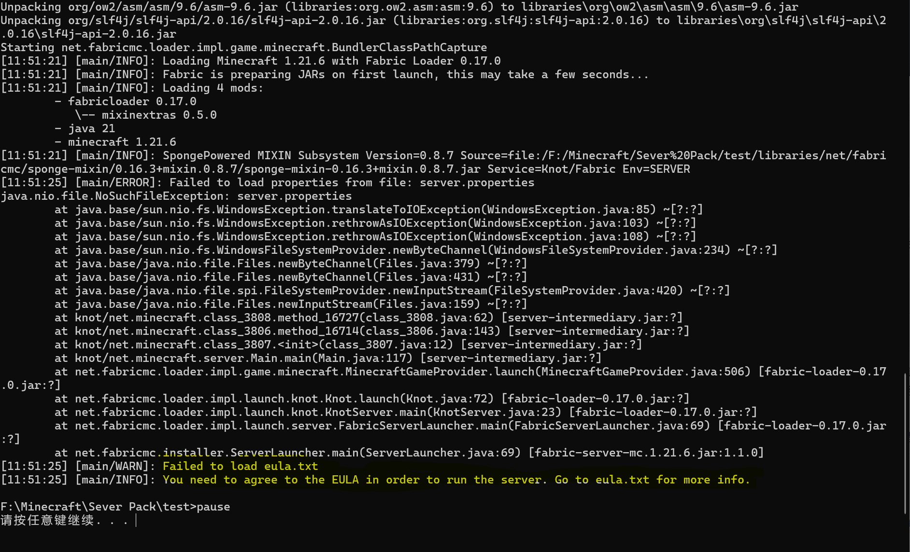
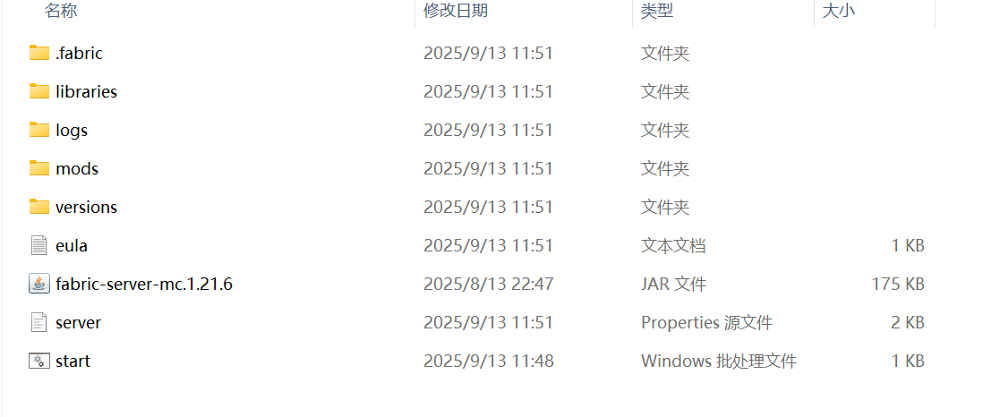
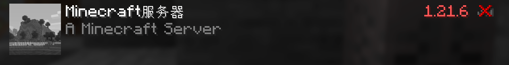
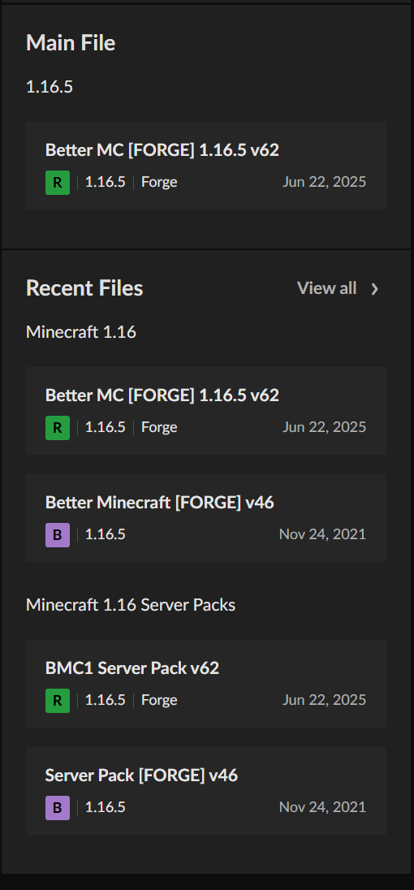

在安装好必要的环境后你就可以准备正式开服了， MC服务端是不同于客户端的，尽管它们的文件结构很相似，跟客户端也有纯净端、模组端之分一样，服务端可分为：
- **原版端**（Vanilla）：官方发布的纯净服务端，性能较差，一般不推荐使用。
- **插件端**（Paper 、Foila 、Spigot 等）：这种服务端允许安装插件，性能较好。插件通常只影响部分游戏玩法和管理，不会添加新的方块、生物等内容。
- **模组端**（Forge 、Neoforge 、Fabric 等）：可以安装模组（ Mod ），对于看到这里的群友来说，通常选择此端，这是绝大多数整合包服务器的基础。
- **混合端**（SpongeForge 、Thermos 、CatServer 等）：这类服务端允许同时安装Mod和插件，但稳定性欠佳，只建议拥有丰富服务器管理经验的人使用。
鉴于群友大多开的都是整合包的服务器，且各类服务器的搭建方式大体相似。这里暂且只介绍模组服的开启。  

# 2.1 模组端服务器

本部分内容分为`从头开启一个服务器`和`利用整合包现有服务端开启`两部分，读者可根据需要选择性阅读。

<div class="xdc-callout xdc-callout--note">

本小节的内容对于开启插件端、混合端等同样适用。此处只是以模组端为例。  

</div>


## 2.1.1 从头开启模组端服务器

首先，请创建一个**新文件夹**准备给你的服务器，下文中将会称其为**服务端根目录。**

<div class="xdc-callout xdc-callout--caution">

**请确保文件夹的完整路径不要包含任何中文和特殊字符（包括空格），这是导致服务器崩溃的常见原因**。

</div>

不同模组端的安装方式略有不同，下面将分别介绍 Forge/NeoForge 、Fabric 的安装方式。 

**a) Forge/NeoForge**   
1. 从Forge/NeoForge官网下载 `Installer` 文件。一般来说， ≥1.20.1 时选择 `NeoForge` ，更低版本时选择`Forge` 。
2. 双击运行你下载到的 `.jar` 文件，选择 `Install Server`（Forge）或 `安裝伺服器` （NeoForge），然后点击右下角的`...`，选择你创建的**服务端根目录**并点击确定。
3. 耐心等待安装完成。

**b) Fabric**   
1. 从[Fabric](https%3A%2F%2Ffabricmc.net%2Fuse%2Fserver%2F)官网上选择你想要的版本，点击中间的蓝色按钮 Executable Server (.jar) 下载即可。
2. 将下载到的 .jar 文件放入你创建的**服务端根目录**。 **请注意：你不能直接双击运行这个**`.jar`**文件**  

<div class="xdc-callout xdc-callout--note">

选择 Forge 还是 Fabric 服务端，以及选择哪一个游戏版本，应当根据你**想要加入的核心模组**的支持情况而定。
你可以在[MCMOD](https%3A%2F%2Fwww.mcmod.cn)网站上查看各个模组的支持情况。
当一个模组支持很多游戏版本时， **相对较新**的版本更容易得到作者的支持。不建议选择**太新**的游戏版本。  

</div>

完成上述**a)** 或 **b)** 安装步骤后，按照如下方式配置：
1. 打开你创建的**服务端根目录**。
2. 在此文件夹中，新建一个文本文档。
3. 打开文本文档，将以下代码复制进去，并按需进行更改：  
```
@echo
java -Xms8G -Xmx12G xxx.jar nogui
pause
```

<div class="xdc-callout xdc-callout--note">

**（可能）需要配置的部分**：
`java`：调用 Java 环境来运行服务器，不修改则默认使用**环境变量中的Java**。你可以将`java`替换为绝对路径（如 "`C:\Program Files\Java\graalvm-jdk-21.0.5+9.1\bin\java.exe`" ）来**指定Java启动**。
`-Xms8G`： 表示服务器启动时初始分配的内存为 **8 GB**。
`-Xmx12G`：表示服务器运行时可使用的最大内存为 **12 GB**。
`xxx.jar`：告诉Java要运行哪个 .jar 文件。 **请将其替换为你下载的**`.jar`**文件的全名**。
关于代码中其他内容，可自行在网上搜索或询问AI，此处不再赘述。  

</div>

4. 输入完之后按`Ctrl+S`保存后关闭文档，接着将文件扩展名由`.txt`改为`.bat`（[看不到扩展名？](https%3A%2F%2Fwww.baidu.com%2Fs%3Fwd%3Dwindows%2520%25E5%25A6%2582%25E4%25BD%2595%25E6%2598%25BE%25E7%25A4%25BA%25E6%2596%2587%25E4%25BB%25B6%25E6%2589%25A9%25E5%25B1%2595%25E5%2590%258D)），完成后双击运行`start.bat`，此时将弹出一个命令行窗口，显示正在下载服务端文件，耐心等待即可。



下载完成后程序会终止，提示你接受`eula`（最终用户许可协议，[EULA|Minecraft](https%3A%2F%2Fwww.minecraft.net%2Fzh-hans%2Feula)），这时候关闭此命令行窗口，此时文件夹已经变成了这样：  



点击`eula`打开，将里面的`false`改为`true`，按`Ctrl+S`保存并关闭  
```
#By changing the setting below to TRUE you are indicating your agreement to our EULA (https://aka.ms/MinecraftEULA).
#Sat Sep 13 11:51:25 CST 2025
eula=false（改成true）  
```
再次点击`start.bat`，此时就相当于正式开启了服务器，耐心等待直至命令行不再跳动，这时**启动客户端->点击多人游戏->点击添加服务器->IP输入**`127.0.0.1`**->点击完成**，如果可以显示出服务器信息说明你已经成功开启服务器，此时你可以进入服务器看看。  



刚刚启动的那个程序就是服务器的终端，在这里你可以使用指令，例如`op CNkiran`给予玩家OP权限，或是`say CNkiran是帅哥`向服务器聊天栏说话。
一些大型整合包的开启通常极慢，你也可以通过随意输入指令（如`help`）判断服务器是否开启。

<div class="xdc-callout xdc-callout--warning">

在服务器终端中输入指令时， **无需输入前缀的**`/`。
- **正确示例**：`stop`（停止服务器）
- **错误示例**： `/stop` 

</div>


## 2.1.2 利用整合包现有服务端开启

一般而言，整合包的作者都会在发布整合包时顺便发布服务端，使用现成的服务端可以**极大节约你的时间**， **大大降低开服难度**，且能**获得更加稳定的游戏体验**。
以 Better MC 整合包为例，可以去[CurseForge](https%3A%2F%2Fwww.curseforge.com%2Fminecraft%2Fsearch%3Fclass%3Dmodpacks)浏览，找到作者发布的 Server Pack ，直接下载即可。如下图：



下载好的服务端一般已经拥有了完整的文件，只需要点击 start.bat 这类的脚本即可开启服务器！
这样你就不用经历上面的过程，因此推荐**开启整合包服务器时一定要先上网搜索，寻找是否有现成的服务端，这将十分高效**。  

<div class="xdc-callout xdc-callout--caution">

不要尝试**直接复制客户端的**`mods`**文件夹**，有极大概率会**丢失**整合包作者修改的配方、任务书、配置文件等，或是根本**无法启动**服务器。

</div>
