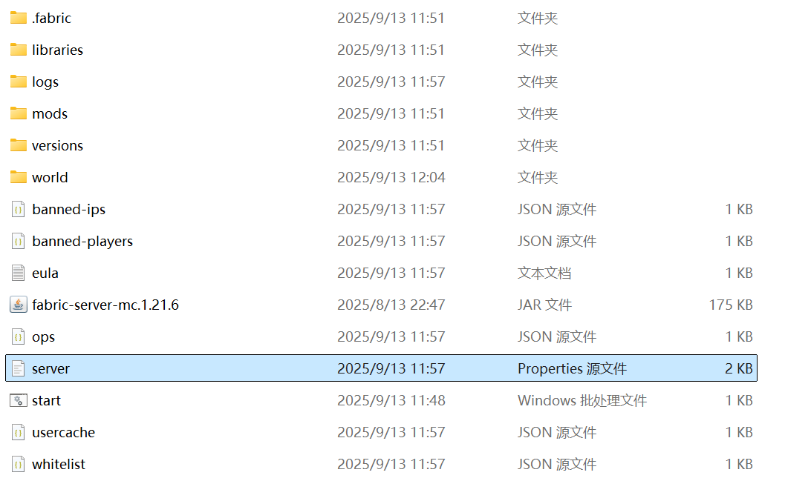
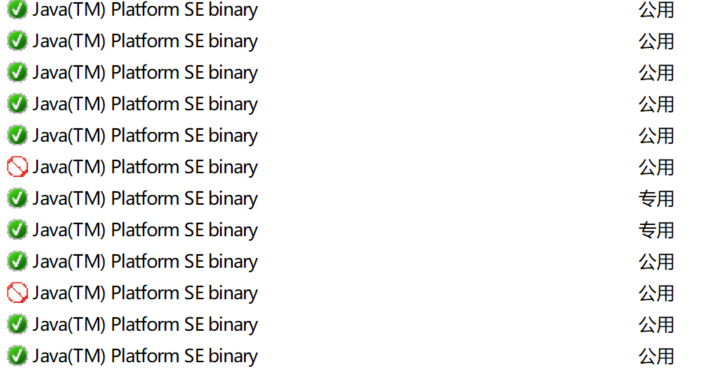
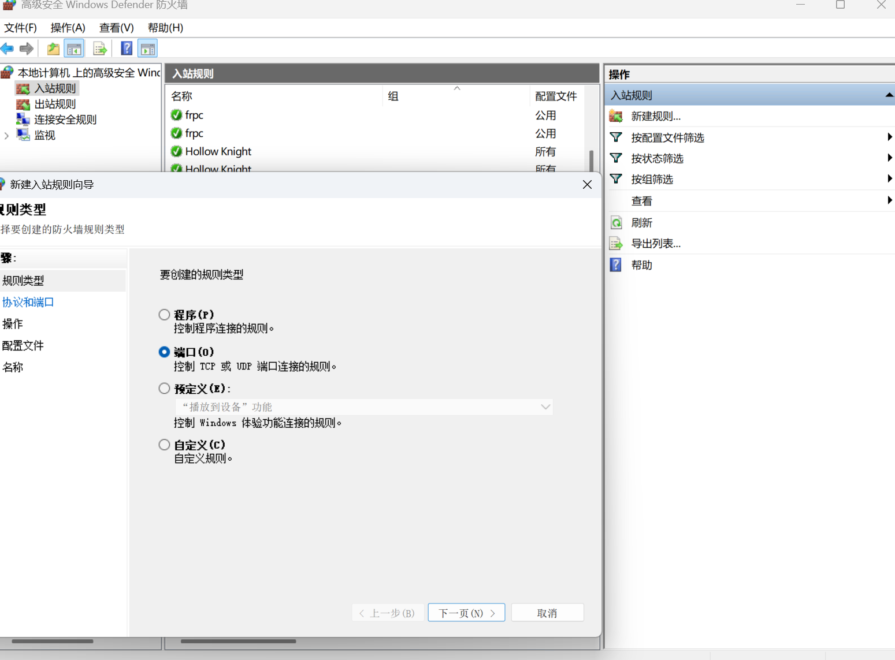

我们已经成功开启了服务器，但这时你应该会注意到：游戏难度怎么没法调、命令方块怎么没法用、为什么别人进不来我的服务器。关于这些问题，特别开启这一章来介绍。

# 3.1 配置你的服务器


<div class="xdc-callout xdc-callout--warning">

修改任何文件之前，请先**关闭服务器**并进行**备份**。

</div>

服务器的各项行为大多可以通过配置文件来修改。通过修改这些文件，你可以：
- **调整服务端本身的核心设置**：如游戏模式、难度、渲染距离等。
- **修改模组/插件的功能**：例如禁用特定精英怪的特效、调整AE2的频道机制等。
强烈推荐使用专业的**文本编辑器**（如 VS Code 、 Notepad++ 等）来完成配置文件的编辑。系统默认的记事本可能会因为文件编码问题而**导致不可预知**的行为。
下面分别介绍**服务器配置文件**、**模组配置文件**、 **插件配置文件**的修改。

## 3.1.1 `server.properties`文件

在服务端的**根目录**中，你可以轻易找到它，这个文件提供了修改服务器内一些选项的接口，熟悉它是非常必要的。  



这里提供一个中文对照简单介绍一下每个选项的功能，至于详细介绍请参考[Minecraft Wiki](https%3A%2F%2Fminecraft.fandom.com%2Fzh%2Fwiki%2FServer.properties)，或是询问AI（这是个好的选择）。  
**a) 基本配置**
- `allow-flight`：是否允许玩家飞行（`true`允许；`false`不允许，通常用于防止作弊）。
- `allow-nether`：是否允许玩家进入地狱维度。
- `broadcast-console-to-ops`：是否将控制台信息广播给OP（管理员）。
- `broadcast-rcon-to-ops`：是否将通过RCON发来的消息广播给OP。
- `difficulty`：游戏难度（`peaceful`=和平,`easy`=简单,`normal`=普通,`hard`=困难）。
- `enable-command-block`：是否启用命令方块。
- `enable-jmx-monitoring`：是否启用JMX监控（通常用于服务器性能监控）。
- `enable-query`：是否启用查询（允许第三方工具查询服务器信息）。
- `enable-rcon`：是否启用远程控制（`RCON`，用于远程管理服务器）。
- `enable-status`：是否允许客户端查询服务器状态。
- `enforce-secure-profile`：是否强制要求玩家使用安全配置文件（对防止冒名登录有帮助）。
- `enforce-whitelist`：是否强制执行白名单（只有白名单中的玩家才能加入）。
- `entity-broadcast-range-percentage`：生物广播范围的百分比，用于优化性能。
- `force-gamemode`：玩家进入服务器时是否强制使玩家进入设定的游戏模式（`true`启用；`false`不启用）。  
**b) 游戏设置**
- `function-permission-level`：函数执行权限等级（2表示允许执行普通命令）。
- `gamemode`：默认游戏模式（`survival`=生存, `creative`=创造, `adventure`=冒险, `spectator`=旁观）。
- `generate-structures`：是否生成结构（例如村庄、要塞等）。
- `generator-settings`：自定义世界生成的设置（JSON格式）。
- `hardcore`：是否启用极限模式（玩家死亡后无法重生）。
- `hide-online-players`：是否隐藏在线玩家列表。
- `level-name`：世界文件夹的名称。
- `level-seed`：世界种子值。
- `level-type`：世界类型（`minecraft:normal`=普通, `minecraft:flat`=超平坦, `minecraft:large_biomes`=大
- 生物群系）。
- `max-chained-neighbor-updates`：最大链式方块更新次数，用于防止方块更新引起的性能问题。
- `max-players`：允许的最大玩家数量。
- `max-tick-time`：服务器每tick允许的最大时间（单位：毫秒，超过此值可能触发崩溃）。
- `max-world-size`：世界的最大边界大小（以方块为单位）。  
**c) 网络和性能**
- `motd`：服务器的介绍消息（显示在服务器列表中）。
- `network-compression-threshold`：压缩阈值（数据包大小超过此值时进行压缩）。
- `online-mode`：是否启用正版验证（ true =启用正版验证； false =允许盗版客户端）。
- `op-permission-level`： OP权限等级（4为最高，允许所有命令）。
- `player-idle-timeout`：玩家闲置多久会被踢出服务器（0表示不踢）。
- `prevent-proxy-connections`：是否防止通过代理连接服务器。
- `previews-chat`：是否启用聊天消息预览。
- `pvp`：是否启用玩家之间的PVP战斗。
- `query.port`：查询协议的端口。
- `rate-limit`：服务器限制每IP每秒的请求数量（0为不限制）。
- `rcon.password`： RCON的密码。
- `rcon.port`： RCON的端口。
- `require-resource-pack`：是否强制玩家加载资源包。
- `resource-pack`：资源包的URL。
- `resource-pack-prompt`：提示玩家安装资源包的信息。
- `resource-pack-sha1`：资源包的SHA1校验值。
- `server-ip`：服务器绑定的IP地址（通常留空，表示自动选择）。
- `server-port`：服务器监听的端口。  
**d) 世界相关**
- `simulation-distance`：模拟距离（服务器会加载的方块区域大小，以区块为单位）。
- `spawn-animals`：是否生成动物。
- `spawn-monsters`：是否生成怪物。
- `spawn-npcs`：是否生成村民和其他NPC。
- `spawn-protection`：出生点保护区域的大小（以方块为单位）。
- `sync-chunk-writes`：是否同步区块写入到硬盘（ true 更安全，但性能较低）。
- `text-filtering-config`：聊天过滤的配置文件路径。
- `use-native-transport`：是否启用本地传输（提升性能）。
- `view-distance`：玩家视距范围（以区块为单位）。
- `white-list`：是否启用白名单。  
通过学习和修改这个文件，你可以解决开服遇到的绝大多数问题！ 

<div class="xdc-callout xdc-callout--note">

并非在每次开服时你都需要关注这些**所有配置**。
一般而言，你**可能需要更改**的内容有这些：
- `allow-flight`：对于整合包来说**推荐开启**，否则可能导致喷气背包飞行时被意外踢出。
- `difficulty`：通常将其改为`hard`，即**困难难度**，这是大多数整合包的推荐难度。
- `enable-command-block`：有部分模组的正常运行需要命令方块，推荐将其设置为 true 。
- `max-players`：最大玩家上限（~~默认的20人其实够用了~~）
- `motd`：服务器的介绍消息（显示在服务器列表中）可以使用[格式化代码](https%3A%2F%2Fzh.minecraft.wiki%2Fw%2F%25E6%25A0%25BC%25E5%25BC%258F%25E5%258C%2596%25E4%25BB%25A3%25E7%25A0%2581)来实现彩色效果。
- `pvp`：是否启用玩家之间的**PVP战斗**。
- `online-mode`：是否启用**正版验证**（`true`=启用正版验证；`false`=允许盗版客户端）。  

</div>


## 3.1.2 模组的配置文件

**模组的配置文件**位于服务器目录中的`config`文件夹内，以各个模组的名称命名。
通常每一个修改项前都会有相应注释，可以**配合翻译软件或AI辅助修改**。  

<div class="xdc-callout xdc-callout--warning">

配置文件的类型很多，如`.yml`、`.cfg`、`.toml`、`.json`等。
编辑`.json`或`.yml`的配置文件时应当非常注意，这两种格式具有**非常严格的格式限制**，极其容易写错。如果文件格式出现错误，可能会出现以下情形：
- 服务器**启动时崩溃**。
- 模组**重新生成整个配置文件**，你所做的修改将全部失效。
强烈建议在更改文件之前**创建备份**，并完全按照**原格式**进行修改，或在修改完成之后**让AI进行检验**。  

</div>


## 3.1.3 插件的配置文件

**插件的配置文件**位于服务器目录中的`plugins`文件夹内，在以各个插件名称命名的**文件夹**内。
插件的配置文件**几乎全部**采用`.yml`（ `YAML`）格式，需要注意的事项同上述**模组服的配置文件**。  

# 3.2 如何让其他人加入我的服务器？

这时候要轮到在第一章我们配置的内网穿透登场了， **在开启服务器时启动内网穿透，别人就可以通过内网穿透提供的IP地址进入你的服务器。**
但有小概率情况，你开启了内网穿透别人依然无法进入，这一般是防火墙设置导致的，在安装Java时一般会直接建立一个入站和出站规则为`java.exe`开启所有端口。  



因此一般情况下启动内网穿透后别人就能直接进入服务器，如果不能的话，就必须手动建立一个入站规则，打开“**高级安全Windows Defender**”，在左侧选择“**入站规则**”，在右侧点击“**新建规则**”：



**选择端口->下一步->不要动其他选项，只在端口输入框内输入**`25565`**并下一步->下一页继续下一步->继续下一步->名称填一个你能记住的，点击完成即可**。
这样一般情况下别人就能进入你的服务器了。  

# 3.3 `start.bat`与皮肤站登录

实际上启动脚本里能添加很多内容，还可以设置自动重启等，例如：
```
@echo off
title 龙之冒险： 新征程v2.1 
:start
echo 正在启动服务器...
"java/bin/java.exe" @user_jvm_args.txt @libraries/net/minecraftforge/forge/1.20.1-47.3.22/win_args.txt %*
echo 服务器已关闭，5 秒后重启... 
timeout /t 5 /nobreak > NUL 
goto start  
```
如果你想要在启动脚本上对服务器进行优化（并不推荐这样做，因为吃力不讨好）， **最好的办法是问AI**，在AI提供的脚本中适当选择，我相信一定能找到适合你的脚本。还有一部分启动脚本会分离内存、核心名等选项，对于这类脚本应当认真翻阅服务端的每个文件，并斟酌修改，多看、多想是必须的！
如果你想将服务器设置为**XDU皮肤站登录**，请在启动脚本中添加一个选项（添加的位置应在`java`之后，`-jar`之前） ，`-javaagent:authlib-injector-1.2.5.jar=https://www.xducraft.cn/api/yggdrasil`，就像这样：
```
@echo off
chcp 65001 >nul

java -javaagent:authlib-injector-1.2.5.jar=https://www.xducraft.cn/api/yggdrasil -Xms8G -Xms12G -jar paper-1.21.5-114.jar nogui

pause  
```
添加完成之后，在服务端文件**根目录**下添加[`authlib-injector-1.2.5.jar`](https%3A%2F%2Fauthlib-injector.yushi.moe%2F)（截止2025.9.21的最新版）。在启动脚本后`authlib-injector`会自动生成。


<div class="xdc-callout xdc-callout--note">

>**皮肤站站长注：**  
>1. XDUcraft皮肤站目前由Butnc赞助和运营。如遇疑似皮肤站故障导致的开服失败或登录问题（这会体现在log里），请即刻联系Butnc修复。  
>2. 出于本站为公益服务XDUcraft之属性，如你计划采用XDUcraft皮肤站作为服务器认证方式，请提前联系Butnc告知，并请将服务器公开服务于XDUcraft社群。如欲用于不开放的私有服，恕不提供服务。   

</div>
