# 一、前言

首先感谢你观看本文档(*´∀`)~♥
正如标题，该文档旨在为你服开的为数不多的Terraria服务器做一个简单的说明，同时也给之前并未接触过泰拉瑞亚这款游戏的新人做一些简单的介绍，但请注意，本文档已有的最后一次修改编写与**2025/10/29**，考虑到泰拉瑞亚制作组的神秘排期，该文档可能具有时效性，最终解释权归开服人员所有。
除此之外，由于不同泰拉瑞亚模组之间带来的游戏体验差距过大，每一次开服的游玩须知可能会有所不同，具体情况可以查询对应的群公告。
文档编写以及预计开服游戏版本如图：

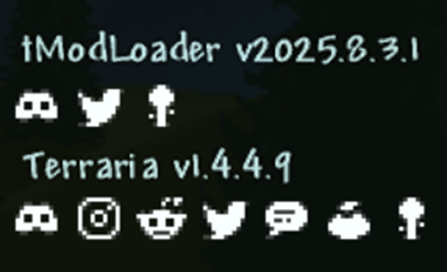

# 二、预先准备

为确保在泰拉瑞亚服务器内的正常游玩体验，我会在这一Part对从下载游戏到正常进入服务器的全流程进行详解（Ps：我是不会教你怎么在Steam购买游戏的，要是这也不会那我就真的没招了(눈‸눈)）：
1. 下载泰拉瑞亚本体以及tModLoader（以下简称**tML**）。
泰拉瑞亚的启动媒介与MC有着显著差异，在不考虑模组的情况下，仅需要通过Steam启动即可正常游玩，若要运行各个制作优良的泰拉瑞亚模组，则需要额外下载tML作为启动器（Ps：tML在你拥有泰拉瑞亚本体后可以免费获取），如图：

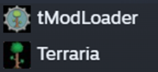

2. 下载服务器所需的各个模组。
点击进入tML的创意工坊，如图：

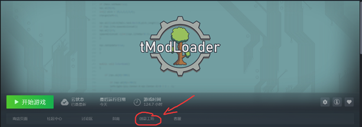

先后选择，“浏览”，“合集”，如图：

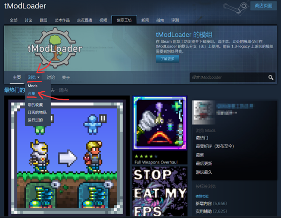

搜索“ForXDUCrafter”，找到本次服务器使用的模组集合，如图：

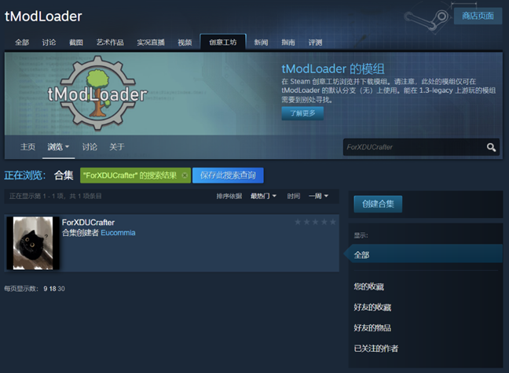

点击进入合集，选择订阅所有：

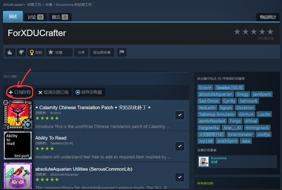

至此，游戏外的准备就告一段落了。
3. 进入游戏并加入服务器
首先，从tML打开游戏，如图（Ps：千万不要搞错了，不然没法加载模组(´ﾟдﾟ`)）：

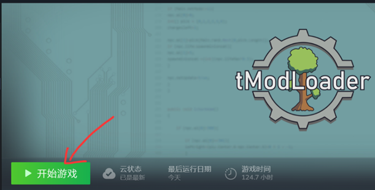

进入游戏后，请先确保自己的游戏版本与服务器游戏版本一致，以避免众多不必要的问题，具体版本号见文档前言，如若版本不同，在游戏主界面右下角可以调整版本（Ps：一般而言，开服默认使用的最新版本，故大概率不会出现游戏版本冲突问题，如若在切换版本的过程中遇见问题，还请自行上网查阅解决办法，我就不在这里浪费时间了(｡ŏ_ŏ)）：

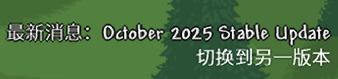

那么，为了正式进入服务器，我们应在主界面菜单选择“多人游戏”：

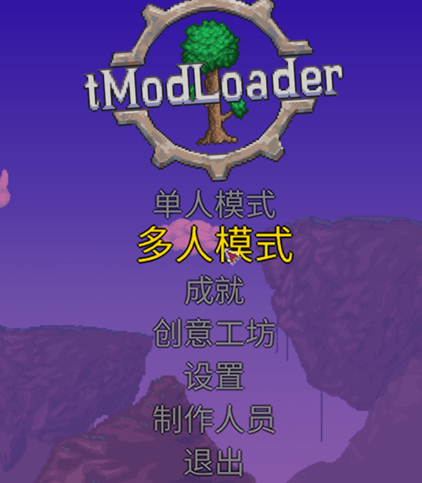

随后，“通过IP加入”：

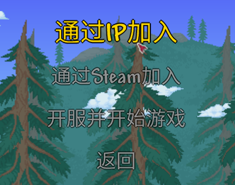

随后，游戏会让我们选择一个游戏角色来加入游戏，为保证正常完整的体验，建议选择“新建角色”：

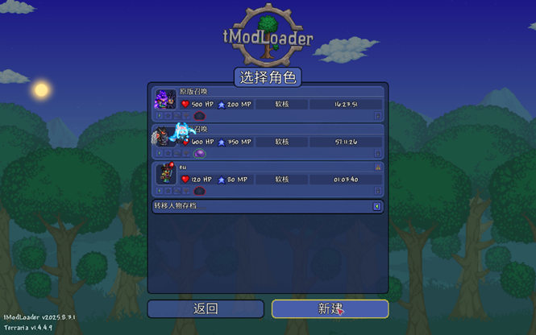

接下来是角色创建界面，我们选择“软核”作为角色本身的难度，其余部分为角色取名或者捏脸环节，该环节请你自由发挥（Ps：如果不是软核，你将会面临类似MC困难模式甚至是极限模式的游戏体验，故而不建议开启）：

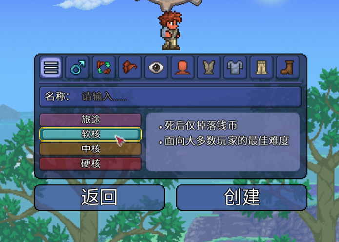

接着，我们会被要求输入服务器IP地址，重点来了，在该界面，我们只需要填写IP地址本体，无需填写端口号（例如，假设完整IP地址为`frp-era.com:7777`，则在此处，我们只需要填写冒号之前的部分，即`frp-era.com`），如图：

在下一个界面，我们被要求填写端口号，此时我们就可以把服务器对应的端口号填入了（Ps：也就是前文提到的例子中冒号之后的部分，即`7777`），如图：

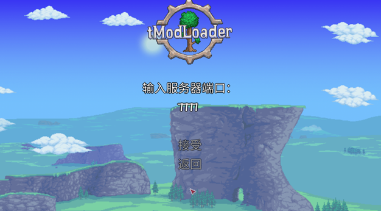

完成上述步骤，你就可以正常的加入服务器进行游玩了ヾ(*´∀ ˋ*)ﾉ
4. 特殊情况
如果你在加入游戏前出现提示，要求你更改模组设置（Ps：包括让你启用/禁用部分模组），或者提示你缺少某些模组，无需担心对你的游戏体验造成破坏，点击右下角的“更改配置”或者“下载模组”，tML就会自动帮你更改游戏配置或者下载相应模组，在新出现的进度条读取完毕后也可以正常游戏。

# 三、游戏本体/模组简介

如果正常过完上述的流程，那么你应该已经可以进入服务器游玩，但可能还对tML加载的这些模组，甚至是泰拉瑞亚本体都不怎么了解，接下来我尽量用通俗易懂的方式为你讲解**游戏/核心模组**的主要内容：
1. 泰拉瑞亚（Terraria）
游戏本体，与MC一样大致上有建筑，冒险，科技三种玩法，但整体偏向冒险侧，因此下列说法仅考虑冒险侧，如有纰漏还请指出。
游戏中包含众多Boss，且有着相对严格的Boss攻略顺序（Ps：当然，你也可以选择逃课），具体表现为不击败特定Boss无法解锁特殊地形，敌怪，掉落物，矿物，部分NPC不会生成，NPC不会出售特定商品等一系列限制，从而无法获取更强更好用的工具装备
在游戏中，玩家变强的方式依靠四种，永久增幅物品，装甲，武器，饰品，而根据装甲和武器的伤害类型，饰品的加成不同，共有四种职业路线供玩家选择------战士，射手，法师，召唤师，基本上职业特性如其名，故不详细解释
游戏内还有众多NPC，有些NPC会出售相当好用的装备，饰品，武器，想要NPC常驻需要为其提供住处，细节可以在游戏内自行探索
游戏的难度设置分为两个部分，一个是角色难度，即前文提到的“软核”，难度效果只会对玩家操控的角色生效，另一个是世界难度，对整个游戏地图生效，具体的难度分级不在此处详细介绍，详情请自行查阅[Wiki](https%3A%2F%2Fterraria.wiki.gg%2Fzh%2F).
2. 灾厄（Calamity）

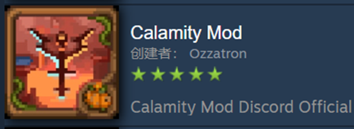

泰拉瑞亚最经典也是最负盛名的模组，堪比MC界暮色森林，但内容含量（Ps：个人认为）大于暮色森林，但这两都一致的不是完整版（Ps：服了，这两的制作组一个比一个能拖(#`皿´)）
该模组为泰拉瑞亚添加了一系列Boss，地形，NPC和众多武器，装备，饰品，并新增如下主要特性：
  1. 新增职业：盗贼，但实际上该职业行为特征更类似于刺客；
  2. 新增难度：在原版原有的世界难度上新增“复仇”，“死亡”难度，并为该难度下Boss重置了AI；
  3. 新增主要设定：怒气，肾上腺素，前者可在战斗中积累，后者仅可以在Boss战，并且保持无伤状态中积累，积累完毕后可开启特殊状态，开启后可为玩家提供高额免伤以及增伤。
3. 灾厄：虚荣（Calamity’s Vanities）

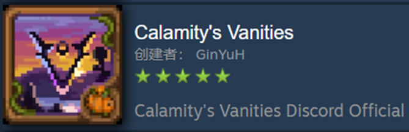

灾厄模组的附属模组，为游戏内新增了一系列装饰性宠物，非常的可爱/搞怪/帅气(　ﾟ∀ﾟ) ﾉ♡
4. 灾劫（Catalyst）

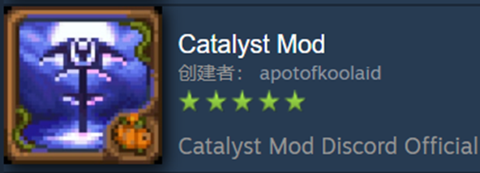

灾厄模组的附属模组，主要在特定时期添加一个新Boss------末世星史莱姆（Ps：超级帅的⁽⁽٩(๑˃̶͈̀ ᗨ ˂̶͈́)۶⁾⁾），以及其对应时期的装备，武器。
5. 巨械之怒（Wrath of the Machines）

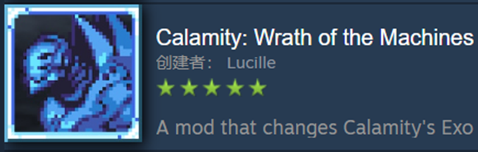

灾厄模组的附属模组，主要内容为修改了大后期Boss星流巨械的AI，Boss战演出，纯粹的帅与震撼*｡٩(ˊωˋ*)و✧*｡
6. Hero’s mod（**其他的可以不看，这个一定要看**）

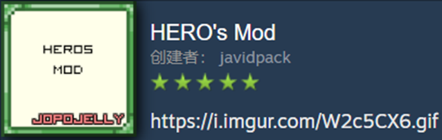

我们泰拉瑞亚自己的创哥（

本次开服，服务器内的玩家权限控制将会基于该模组实现，所以以下内容请务必看完：
进入服务器之后，在你的屏幕下方会有一个这样子的图标：

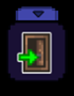

点开之后，你会看到这样子一个界面：

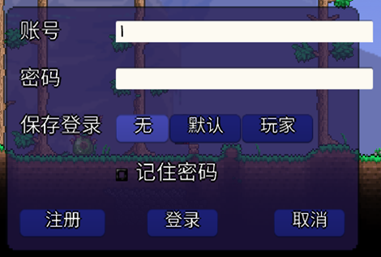

在该界面，随意想一个账号密码，注册，登录即可正常游玩了（Ps.小编没试过不注册登录能不能正常体验游戏，要是你有闲心可以试试awa）
**注意！！！**
保存登录这一栏的三个选项的含义如下：
    - 无：每一次重新进入游戏都需要重新输入账号密码登录；
    - 默认：绑定你的电脑，以后无论使用那个角色进入哪个服务器都会默认使用这个账号（你也可以另外注册一个）；
    - 玩家：绑定游戏角色，当你用同一个游戏角色进入不同的服务器时默认使用这个账号（你也还是可以注册另外的账号）。
更加详细的介绍可以查看[[HERO's Mod] 服务器玩家管理教程](https%3A%2F%2Fwww.bilibili.com%2Fvideo%2FBV1E14y1o7Zw%2F%3Fshare_source%3Dcopy_web%26vd_source%3D39d7c5e53611060a93b77b3d3483c5b0)，小编就不再此处多嘴了
7. 更好的体验（Quality of Life）以及一系列游戏体验优化模组

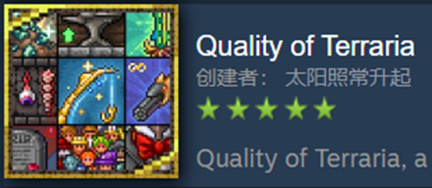

此处谈及的为一系列模组，以更好的体验为代表，这些模组对泰拉瑞亚的游玩提供了极大便利，包括但不限于，自动钓鱼机，弹药到达指定数额视为无限，药水效果永续，一键生成NPC房屋的法杖……具体内容请在游戏内自行发掘。
8. 魔法存储（Magic Storage）

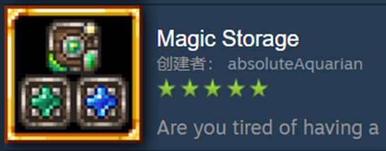

最简单易懂的解释——泰拉瑞亚版本的Refined Storage，并且不像MC中那样有电力消耗，还可以把熔炉，铁砧等各种工作站融合，唯一真神。
9. Recipe Browser

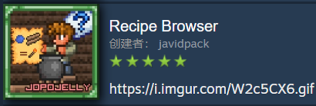

最简单易懂的解释——泰拉瑞亚版本的JEI，真神之一。
10. 共享地图（Shared World Map）

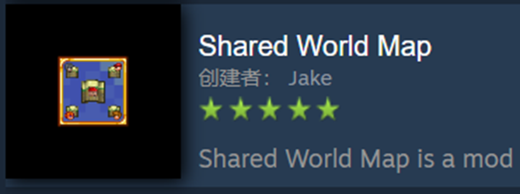

如该模组名字，可以使玩家之前分享自己探索的地图，可以大幅度节省跑图时间。

# 四、游玩须知

1. 由于上述模组的加入，服务器的整个流程预计不会很坐牢（Ps：除了最开始的开荒阶段），打Boss大概会演变为车轮战，因此，游戏难度的选择为大师死亡，世界大小为大世界；
2. 请不要带着一背包超过服务器当前时期的物品进入服务器，这会严重影响其他玩家的游戏体验，服务器仅允许携带不提供伤害，不提供照明的纯装饰性宠物，和装饰性装甲；
3. 不要恶意破坏服务器内NPC住房（Ps：渔夫这个出生除外눈言눈）；
4. 由于不可避免地数值随游戏进度膨胀，玩家之间的PVP终究会演变成激情互秒，故关闭服务器内PVP；
5. 不要！不要！不要！在肉山前/困难模式前搭建世界平台（即一个平台从地图最左侧延伸到地图最右侧），这会导致灾厄模组中肉山后/困难模式下新增的一个地形直接消失，从而连锁反应导致灾劫模组中的最终BOSS------末世星史莱姆，没有正常召唤途径；
6. 如在游玩过程遇见问题，可以向服主或卧虎藏龙的群友求助；
7. 暂时只想到这么多，剩下的我想到了再写；
8. 以上须知请务必遵守，最终解释权归服主（Ps：目前是Eu我）所有。
